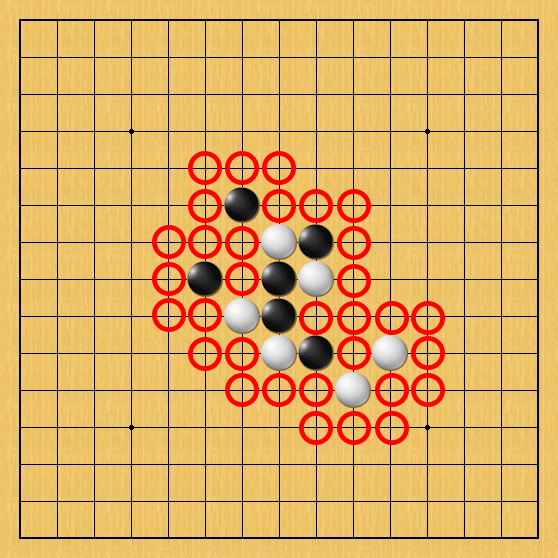
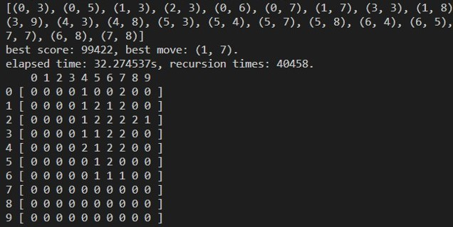

> 練習基礎AI演算法的入門題目，博弈樹搜尋與啟發式演算法，順手完成一個 GUI [小遊戲]。

{:height="60%" width="60%"}

## Introduction

>傳統的AI演算法題目，以非神經網路的方式來嘗試AI撰寫。睡不著乾脆更新下Blog，至少忙起來能讓我轉移一些注意力，順便做個筆記。
{: .block-tip }

博弈樹(Game Tree)其實就是一種將賽局中所有可能展開後的 Tree，那其中的每個 Node 就代表著遊戲進行中的某個狀態，
那我們以 Tic-Tac-Toe (井字棋)來看，就會有 26830 種遊戲過程。

Tic-Tac-Toe 的棋盤大小不過才 3x3 就有 26830 種可能，那五子棋的棋盤為 15x15 一個簡易的算法是 15! 幾近是天文數字。
如果想以全部遍歷的方式來找出最佳解幾乎是不可能做到的事，那這時就需要一些策略去找出最佳路徑，所以我們會用到幾種算法。

{:height="50%" width="50%"}

1. Maximin algorithm. (對抗性的搜尋算法)
2. Alpha Beta pruning. (剪枝算法)
3. Heuristic. (啟發式算法)

#### [Maximin algorithm]

Maximin algorithm (極大極小值演算法)，是一種找出失敗的最大可能性下的最小值的演算法，這是 wikipedia 上的解釋。
簡單來說在一個五子棋博弈樹中，必然有兩個不同的玩家互相下棋，故博弈樹我們也可以分成玩家層與AI層來看待，因此在搜尋的過程中我們要去找尋每一層的最有利狀態，
最後去找到玩家下的最好的狀態下，AI能下出的最佳步驟。

{:height="60%" width="60%"}

[the source picture](https://thesharperdev.com/implementing-minimax-tree-search/)

其實看上圖就能發現其實就跟 Max-Min-Heap 很相像，只是今天 Heap 是從下往上，
但 Tree 是從上往下，一個中序遍歷的搜尋方式。在搜尋過程中我們要去找到都是極大或極小的路徑，
但是如果我們真的去遍歷整個棋盤，時間複雜度將為 O(b2)，
在棋盤為15*15，深度為4的情況下，2254是一個非常慢的演算法。

#### [Alpha Beta pruning]

但是即便我們能做到棋盤的對抗搜尋，但是搜尋時間還是很慢，因此我們需要去做到剪枝的動作，
放棄不可能的分支做搜尋，把希望放在更有可能的分支上以做到更深的深度。在最糟的情況下，
時間複雜度將為 O(b2)，而在最佳的情況下有機會達到 O(sqrt(bd))，

實作上我們就是在遞迴時，如果當前層數為極大層，但是下下層出現一個比最大值還要小的節點我們就直接剪掉，
因為我們要找的是極大值，就不用去考慮更小的值了，同理運用在極小層。

{:height="60%" width="60%"}

Wikipedia中圖的第三層中的 7 節點其實也是要剪掉的，圖有錯誤。

#### [Heuristic]

但是即使我們能做到剪枝搜索時間還是平均需要 O(b3d/4)，但同時我們也知道初始的搜尋節點很重要，
如果一個棋盤如下圖，我們以一個2D Array來實現這個棋盤狀態，像是 x, y = 0, 0這樣的位置如果不會影響大局完全沒有搜尋的必要。

{:height="60%" width="60%"}

|  State   | Operate |
|  ----  | ----  |
| 五子 | 直接返回 |
| 活四  | 直接返回 |
| 活三  | ... |
| 死三  | ... |

{:height="60%" width="60%"}

因此我們可以在尋找搜尋節點以有鄰居的空位為主，並且加入一些評分機制來對這些位置排序：

把每次搜尋的位置 print 出來來觀察搜尋的順序與影響。除去五子活四這種直接將軍的局面，
剩下的依照分數排序來做搜尋，這樣我們能更快的找到最佳的路徑，
分數不符的路徑就將會被剪掉，把時間用來做到更深的搜尋層數。

要記住即便使用了啟發式函數，但是只要局面變得複雜，搜尋速度同樣會下降很多，
畢竟每做一個搜尋就是需要付出 Pd 的時間消耗，因此排序並消除不重要位置的步驟就很重要。

#### Note

1. 寫輔助函數時的注意事項
    - 在寫這些輔助函數的時候，要盡量減少做整個棋盤的搜尋動作，同時可以嘗試將棋盤視為字串，
    這樣就能以 Regex 來處理連線確認將會大幅加快執行速度，尤其是如果你的棋盤

2. 評估函數要仔細設計
    - 評估函數；尋找的棋形；搜尋深度；是最直接的影響棋力的選項，如果AI的落子有問題，
    通常應該往這幾個方向做修改，例如搜尋深度與評估函數設計不好就有可能使AI自殺的情形發生。

> ##### NOTE
>
> 之後更新，目前已完成一個簡易的算法在Github，希望能在過年前把它做到一個更滿意的狀態。
{: .block-tip }

[小遊戲]: https://github.com/Hotshot824/gomoku-ai
[Maximin algorithm]: https://en.wikipedia.org/wiki/Minimax
[Alpha Beta pruning]: https://en.wikipedia.org/wiki/Alpha%E2%80%93beta_pruning
[Heuristic]: https://en.wikipedia.org/wiki/Heuristic_(computer_science)