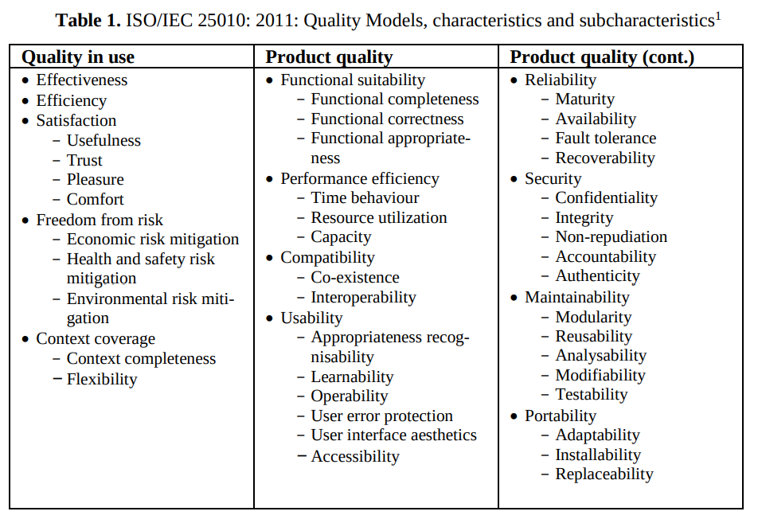
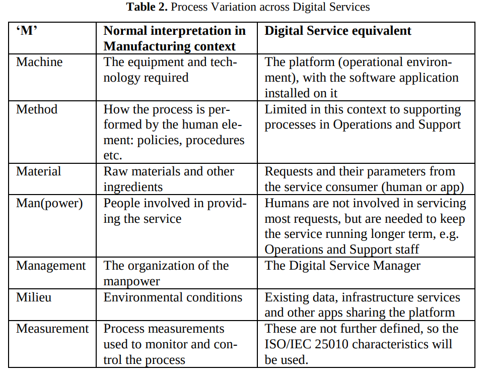

> John Estdale & Elli Georgiadou, (2018) Applying the ISO/IEC 25010 Quality Models to Software Product, IEEE.
{: .block-tip }

### 1. Introduction

軟體開發過程中，我們著重的是如何交付軟體產品，但是潛在的購買者其實更在意軟體產品能為他們帶來的未來服務價值，也就是軟體能夠在實際使用中帶來的效益。`ISO/IEC 25010: 2011` 是評估軟體產品質量的重要標準，可以幫助我們確定軟體流程的交付表現以及提出改進建議。論文從以生命週期為導向的服務觀點出發，探討 `ISO/IEC 25010` 模型的範圍和解釋，也確認了購買者關注的其他重要軟體產品方面，並提出了可能需要的品質要求和評估方式。

### 2. ISO/IEC 250xx series: SQuaRE

`SQuaRE` 標準的目標是幫助開發和獲取系統和軟件產品的人員規範和評價產品的質量要求，並建立一個支持質量測量的過程。過去的 `ISO/IEC 9001` 標準主要關注是否符合先規定的`規格或要求`，而現再更包含了客戶上的需求與期望。

在軟體品質特徵中可分為兩個模型：  
1. `使用品質(Quality in Use)` 是指產品能夠在特定使用情境下，由特定用戶滿足其需求並達成其特定目標的程度。
2. `產品品質(Product Quality)` 則是指與軟體的靜態特性和電腦系統的動態特性相關的品質特徵，這些特徵包括了例如可靠性、效能、可維護性、可移植性等。  

詳細的敘述與子項可見[Note - ISO/IEC]

**在論文中將 `ISO/IEC 25010: 2011` 分為兩種類型的模型**
{:height="80%" width="80%"}

### 3. Applying the ISO/IEC 25010: 2011 Quality Models

不像物理世界，有明確獨立的尺寸和明確定義的度量（如長度、質量、時間、電流、熱力學溫度、光強度等）。  
軟件品質概念則有點模糊例如兼容性，重新定義和重組這些概念就是 `ISO/IEC 25010` 工作的一部分。

>"a conceptual framework and not a ready-to-use solution" from Biscoglio and Marchetti (2015) define software quality evaluation plans in a conference paper.

**應用品質管理中的 `7Ms Model` 來涵蓋軟體開發中的行為**
{:height="80%" width="80%"}

1. `7Ms Model` 是品質管理中常使用的工具，其中的 M 可視為是品質管理中的基本要素，其中包含:  
    - `Machine`, `Method`, `Material`, `Manpower`, `Management`, `Milieu`, `Measurement`

### 4. Quality in Use

第4、5節則對 Table 1. 的結構來依序查看各個特性的定義，並分析與評估各個特性，若有需要則進一步評估子特性。

**4.1 Achievement of Needs**  
-   Effectiveness(效果), Efficiency(效率) 
    -   ISO/IEC 25010 不包含對應用程式的具體功能與特色的評估，它們的價值僅能由採購方的組織的需要來評估。
    -   因此這裡的效果與效率僅為當用戶實現特定目標時的指標。
-   Example:
    -   Apple Inc. 在定義 App store 時將這一需求描述為:  `“If your App doesn’t provide some form of lasting entertainment value, or is just plain creepy, it may not be accepted.” `; `「如果你的應用程式沒有提供持久的娛樂價值，或者很令人不舒服，它可能不會被接受。」` 這就與 `ISO/IEC` 標準所討論的 `stated and implied needs` 有所偏差。

**4.2 Freedom from Risk**
-   講述對於不同行業上產品應該尊崇法律和法規的要求，尤其是它們可能在不同的時間，由不同的機構所制定因此經常是複雜並易發生衝突的。
-   但是產品供應者應該要了解在銷售區域內使用其產品的所有限制，並明確說明使用限制與假設。
-   論文中認為應該回復 ISO/IEC 過去的 `Compli-ance` 子項目已涵蓋對於法律、監管與合同相關的合符規範性要求。

### 5 Product Quality  
這些關於 Product Quality(產品品質)的特正主要是開發者/供應商或在技術上有更多參與的購買者所關心的。

**Functional suitability(功能適用性)**
-   其子項 Completeness(完整性), Correctness(正確性), Appropriateness(適合性)這些都是開發者所進行的先行評估，但是最終評估還是在購買方的手上。

**Performance efficiency(性能效能)**
-   對於軟體開發上所進行的評估與測試可能不是最終交付後的實際運行環境，因此在開發期間進行的軟體產品測試可能無法完全反映最終交付後的表現。

**5.1 Compatibility(兼容性)**
-   Co-existence(共存性)指產品能否與其他在同一平台上運行的產品協調共存，並使用所提供的服務共享資源，並且不要影響其他服務。
-   Interoperability(互相操作性)指產品與其他系統、產品或組件之間是否能夠交換信息。如在作業系統檔案區域中將檔案以滑鼠拖拉至產品檔案上傳區域。

**5.2 Usability(易用性)**
-   易用性下的子特性可以被理解為用戶如何識別一個產品是否適合它們的程度，所以包含了供應者如何描述系統，說明文件等等。

**5.3 Reliability(可靠性)**
-   可靠性關注的是產品的穩定性和持續性，需要考慮多種因素，包括硬件故障、人為錯誤、系統崩潰、網路中斷等等。

**5.4 Security(安全性)**
-   產品要確保如`控制存取`, `確保資料完整性`, `保護機密`等等的機制，例如 Apple store 上因為 APP 大多經由批准過因此基本保證使用者不會在商店中遭遇惡意軟體。

**5.5 Maintainability(可維護性)**  
可維護性定義為能被預期的使用者有效的修改與維護的程度
-   Analyzability(可分析性)包括可預期的評估變化的影響，判斷缺失和故障，也就是在工作前的能做的評估。與現場工作中能注意到的問題，這需要有效的識別錯誤機制。
-   Testability(可測試性)可測試性是很重要的，其中包含 `low-level` 中的組件測試、單元測試。與 `high-level` 的測試(通過開發和維護回歸測試套件來確認服務沒有下降級別，
即性能下降至比之前更差的狀態)。
-   `Extensibility(可擴張性)` 是在先前[20]曾提出過一個應該增加的主要特性，提出模塊化和物件導向的軟體可以更容易的擴展，
並且 Tested classed 可以直接集成到現有系統中，無須重頭開始建構或測試整個系統。

>[20] Siakas, K.V., Georgiadou, E.: PERFUMES: A Scent of Product Quality Characteristics. In: International Software Quality Management Conference, pp. 211-20. BCS, London (2005)

**5.6 Portability(可移植性)**  
傳統上軟體的可移植性是指開發者對於 `Source code` 的再編譯、建構等。對於指定平台購買指定的版本，當轉移到新的平台時需要購買新的實現，並將數據、配置等轉移到新的環境中。
-   ISO/IEC 25010 的可移植性包含購買的產品能在預期的平台上運行，包含插件兼容，虛擬的或基於雲的環境。
-   Replaceability(可替換性)則指現有產品的一個版本被另一個版本替換，開發者應該考慮更廣泛的服務問題，如現有數據如何遷移與減少使用者介面的改面。
商業慣例是`向前兼容`就是任何新版本應該保持所有以前的功能與特性，沒有倒退。

**5.7 Supportability(可支援性)**
-   作者認為應該在 ISO 中加入的特性，與`5.5 Maintainability`類似是預測未來的一個因素，但與可維護性不同的是這代表的是一些開發方對購買者所需要的支援，
如: 緊急求救電話，遠程診斷不接觸 `Source code` 或其他私密訊息的支持; 信息或工具。這是開發方在競爭市場上提供高品質產品和服務的關鍵之一。

##### 6. Other Characteristics of the Product at Delivery

作者認為在 `SQuaRE` 中其他重要的特性與影響

**6.1 Honesty and Openness**  

有明確的要求要進行開放和誠實的溝通，既針對考慮購買的買方，也針對下載應用的使用者。在SQuaRE品質模型中，誤導性的文件並未被考慮進去。

-   如蘋果公司拒絕某些應用的原因包括: 
    -   「應用未能如開發人員所宣稱的那樣運作」
    -   「應用包含未公開或與描述不一致的隱藏功能」
    -   「旨在提供詐欺或假功能的應用，但未明確標示」。

**6.2 Product Maturity**
-   產品的成熟度生命週期:  
**initial development(初期開發)**, **active evolution(積極發展)**, **servicing(維護與服務)**, **phase out(淘汰)**.  

追求可靠性的購買者更喜歡第三階段的產品，而更關注產品特性與功能的購買者可能更喜歡第二階段的產品。
一個產品會隨著時間的變得越來越複雜，除非進行減少複雜度的維護工作。在[23]中顯示了過去產品維護對於未來品質的強烈影響。

>[23] Lehman M.M., Perry D.E. Ramil J.F.: Implication of Evolution Metrics on Software Maintenance. In: International Conf on Software Maintenance, pp. 208-17, IEEE (1998). doi: 10.1109/ICSM.1998.738510

##### 7. In-life Experience, post-Deployment

最終對購買者來說重要的是產品在實際使用上的表現，但這個表現必須等到部屬或購買後才能知曉。
`SQuaRE` 目前沒有涉及這些方面，這部分都是上線後流程，如果買家要求產品供應商以協議的價格提供所有這些支持服務，則需要建立全面的額外服務品質指標。

**7.1 Customer Support by Supplier**  

儘管支援服務是一種部署後活動，但供應商的支援能力仍然是軟體產品評估中重要的一個方面，即使它被明確地排除在 `ISO/IEC 250xx` 系列的範圍之外因為這只受到產品技術的輕微影響，應該至少要被提及。

**7.2 In-life Maintenance**  

購買者需要知道供應商的政策和流程，以便預測和規劃維護產品的工作與成本。例如: 承諾修復錯誤，發布錯誤修復與新版本的品質與變化等。

##### 8. Conclusions & 9. Relation to SPI Manifesto

作者最主要的貢獻是討論了 ISO/IEC 25010 的範圍，並進一步的討論: 合法，法規與合約遵循性、可擴展性、支持性、誠實描述、產品成熟度和包括供應商客戶支持和部署後的維護在內的活動。  
以此使 ISO/IEC 25010 成為更全面的品質模型，可用來評估規範是否應該改進、維持或忽略某些維度的基礎。

> SPI Manifesto: Base improvement on experience and measurements.
> Pries-Heje J., Johanson J., (eds.): SPI Manifesto, http://www.iscn.com/Images/SPI_Manifesto_A.1.2.2010.pdf last accessed 2018/05/28

> ##### NOTE
>
> Last edit 04-21-2023 12:32
{: .block-warning }

[Note - ISO/IEC]:https://hotshot824.github.io/jekyll/2023-04-13-software_standard.html