> Operating System: Design and Implementation course notes from CCU, lecturer Shiwu-Lo. 
{: .block-tip }

### Introduction

[1.1 Why need OS](./2023-09-12-operating_system_introduction.html#11-why-need-os)  
[1.3 User mode/Kernel mode](./2023-09-12-operating_system_introduction.html#13-user-modekernel-mode)  
[1.5 User space/Kernel space](./2023-09-12-operating_system_introduction.html#15-user-spacekernel-space)  
[1.6 Memory management](./2023-09-12-operating_system_introduction.html#16-memory-management)  
[1.7 Change mode & System call](./2023-09-12-operating_system_introduction.html#17-change-mode--system-call)  
[1.8 Signal & Systemcall](./2023-09-12-operating_system_introduction.html#18-signal--systemcall)  
[1.9 Monolithic kernel](./2023-09-12-operating_system_introduction.html#19-monolithic-kernel)  
[1.10 Kernel module](./2023-09-12-operating_system_introduction.html#110-kernel-module)  

##### 1.1 Why need OS

1. 作業系統使電腦更易於使用
    -   磁碟是由 Block(通常為4K) 所組成，OS 將磁碟劃分為 File，再將檔案歸類為 Folder 才易於使用。
    -   可程式化(Programmable) 變得更容易，OS 能執行執行檔，CPU 執行不同程式碼就會有不同功能。
    OS 使程式碼抽象為執行檔，能夠從各個地方載入可執行的程式碼，並且賦予邏輯上的支援。
    -   硬體抽象化(Hardware abstraction) 如滑鼠、觸控板被 OS 抽象化為一個指標裝置，使使用者能統一操作。
    -   OS 上不會只運行一個程式，因此必須有應用程式之間的通訊，如: Copy & Paste。

2.  使電腦的硬體使用更有效率(資源分配)
    -   一台電腦可能有多個硬體存在，OS 可以使這些硬體一起工作。
    -   例如在足夠記憶體的情況下可以同時載入多個執行檔並執行，並使用硬碟堆放暫時用不到的記憶體，以空出記憶體給真正需要的程式。
    -   透過 CPU Scheduler，使 I/O、CPU 都能維持在高使用率。

##### 1.3 User mode/Kernel mode

大部分的作業系統以雙系統(Dual-Mode)(Linux, Windows)，可分為 User mode 與 Kernel mode:

-   **Dual mode operation**
-   **User mode**: CPU 所提供的執行模式，只能存取有限的硬體資源，如:  
普通運算所需的暫存器、部分記憶體內容
    -   Various applications: libreoffice, gnuplot, pdf viewer
    -   GUI: X11, Gnome, KDE
    -   System manager: bash, vi, ls, mount, passwd
    -   Development tools: gcc, gdb
    -   System service: sftpd, sshd
    -   Basic inetrnet communication software: Browser, ftp
    -   Other library: courses, math
    -   Standard function library: Parts defined in POSIX like, libC, pthread

-   **Kernel mode**: CPU 所提供的執行模式，可以對硬體做任何的變更，在 Kernel mode 能額外控制的部分如下:  
控制暫存器(Control register)，例如控制 MMU(Memory management unit) 的相關暫存器、所有記憶體
    -   Memory management
    -   Schedule and thread management
    -   Inter-Process communication
    -   Virtual memory
    -   Network communication
    -   Scheduler
    -   File system
    -   Safety, Authority management
    -   I/O Subsystem

這種模式下 Kernel mode 才能完全的掌控硬體，今天如果 User mode 上的程式想要存取硬碟則需要透過 System call 來進行操作。在 Linux 的設計原則是速度第一，當然程式越靠近硬體就會更快。
但如果 User mode 想要操作硬體要透過 System call 來進行也就是改變模式(Change mode)，但這樣會產生一定的**消耗**。而在 Kernel mode 中進行操作硬體就只等於 Function call 的消耗而已。

-   User mode 想要進行切換就可能需要**保存當前狀態以回復**、**清除 Pipeline**、**清除 TLB 和 Cache** 這些額外消耗。
-   Dual mode 通常需要硬體額外支援，例如提供一個 **Mode bit** 的暫存器來決定現在是哪一種 Mode。

> 例如一個網頁，可以將靜態頁面放在 Kernel mode，動態頁面在 User mode。

但不是將所有程式都放在 Kernel mode，因為只要是程式就會有 Bug，在 Kernel mode 中發生了 Bug 很可能導致整個系統的崩潰。

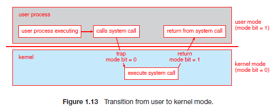{:height="75%" width="75%"}

##### 1.5 User space/Kernel space

虛擬記憶體([Virtual memory])也分為 User/Kernel space，這主要是為了保護 Memory 與 Hardware。
CPU 在切分記憶體時每個單位會附加一些屬性，其中一個重要的屬性就是指出該單位為 User/Kernel space。

-   Task 之間不能讀取各自的 User space。
-   Kernel 才能改變權限，I/O，並且擁有所有的存取權。

|  可否存取 | Kernel space |  User space  |  Privilege instructions |
| Kernel mode | ✓ |  ✓  |  ✓  |
| User mode |    |  ✓  |    |

##### 1.6 Memory management

Virtual memory 的管理單位可以分為兩種，分頁(Paging)，分段(Segmentation):

-   Paging: 將連續的記憶體在邏輯上變成 4K 大小的 Page 方便軟、硬體對記憶體進行管理
    -   這是目前最常見的做法，在管理上可以較好的分配記憶體
    -   作業系統會盡量使用 Huge page(大分頁)，一個 Huge page 可以有 2M 到 1G 的大小，因為這樣需要的 Page 數量較少，
    在硬體管理上會希望 Page 盡量大一點。
    -   但是 Linux 在 User space 幾乎沒有使用大分頁，除非特別去設定要使用 Huge page，因為在軟體上管理 Page 反而 4K 可以減少記憶體浪費。 
-   Segmentation: 將連續的記憶體在邏輯上變成各個大小不一的 Segment，每個 Segment 對應到程式的特定用途
    -   x86 在 32 位元模式支援 segmentation
    -   Segment 在配置上比較困難，但在嵌入式系統中因為沒有什麼動態配置的需求因此較常用

> 以上的方法都需要硬體支援，是因為 CPU 與硬體的處理速度因此需要硬體支援才能使速度提升。

##### 1.7 Change mode & System call

**從 User mode 切換到 Kernel mode**，是透過 `syscall` 這個組語來進行:  
OS init 時會告訴 CPU 當使用者呼叫 `syscall` 的時候，指令指標(%RIP Register)應該設定為何(system call 的進入點)`，syscall` 做兩件事:
1.  保存當前的程式狀態，以便之後返回
2.  將模式切換為 Kernel mode，例如將 Mode bit 設為 0
3.  準備要被呼叫的 System call，例如在x86-64架構中的 %RAX Register 放入要被呼叫的 System call 編號

**切換 Stack**:
-   User space stack 一開始只配置 16K，不夠再送 Signal 給 Kernel 一次多要 4K Page 最多成長到 8M
-   Kernel space stack 的大小並不會很大，並且 System call 也不會使用產生堆疊的寫法
-   User/Kernel mode 的堆疊是分開的，Kernel 不能產生 fault，所以在 Kernel mode 使用的是 Kernel space stack
    -   穩定性: 例如 User mode 已經故意執行了一個 7.8M 堆疊的程式，此時 Change mode 但沒有使用 Kernel space 這樣就會遇到 Segmentation fault
    -   保密性: 同時 User space stack 如果執行完沒有進行清空也有可能洩漏 Kernel 的資料
-   在 syscall 準備 system call 的時候同時還要準備執行環境，例如執行 write(clang) 就要準備好要使用的 stack 來呼叫 C 函數
-   如果在沒辦法切換堆疊的系統上，也要盡量表留一個給 Kernel mode 使用的堆疊大小 16K

**從 Kernel mode 回到 User mode**，需要用到 `sysret` 指令來進行，此時 OS 會返回地址(接下來執行的 User mode 程式碼)`，sysret` 做兩件事:  
1.   返回 user mode 的程式碼位置，例如 x64 放在 %RCX Register  
2.   切換為 user mode，例如將 Mode bit 設為 1

> 不是所有的 System call 都會進行完整的 Context switch，例如 `getpid()`，就不需要把當前的程式狀態保存完整。
{: .block-tip }

-   **System call handler** 必須確保從 Kernel 返回 User mode 時，程式**將來**可以**繼續**執行

Super user 也是使用相同的 System call 進入點，大部分的 System call 會判斷權限但 `uid=0` 的時候就直接通過，General user 的 `uid > 1000`。
Linux 定義了約 400 System call(Function)，大部分都透過 syscall 進入 Kernel。

##### 1.8 Signal & Systemcall

當 Kernel 有特別事件需要主動通知 Process，就使用 Signal 機制，Signal 接受兩個重要參數: 事件編號、發生該事件時呼叫該程式所定義的特定函數
1.  事件編號: 例如 SIGINT 的編號是 2，表示鍵盤中斷(例如 Ctrl + C)，每種 Signal 都有唯一的編號，OS 中已被定義
2.  該事件發生時所處理的函數，可以是程式自己定義的函數或是系統默認的函數呼叫

Linux kernel 只允許一個 Process 同時間發出一個 Blocking system call，需要等待 Kernel 完成該工作(System call)才回傳的系統呼叫。
當 Process 發出 Blocking system call 後，該 System call 還未結束前如果發生 signal(例如 Ctrl + C)，Kernel 該如何處理?

1.  不理會該 Signal，繼續完成 System call
2.  處理該 Signal，該 System call 變成失敗，通常作業系統會重新起始(Redo)該 System call

> 延伸閱讀 [Linux Signals]、[Interruption of system calls when a signal is caught]

##### 1.9 Monolithic Kernel

> 假如一個人一天可以讀 1000 行程式碼，Linux kernel 的成長速度可能是一天超過 3000 行。

-   Monolithic kernel 大部分的系統功能都設計在 Kernel mode 中，這樣的好處是執行效率，各個模組間的溝通僅為 Function call，
但同樣的 Kernel 也變得越來越複雜，也容易產生錯誤。
-   Micro kernel 盡可能的將 OS 的系統服務執行於 User mode，讓系統變的較為穩定，
但是 User mode 的 Process 通訊需要觸發 Context switch 與 Mode change，效能較為低落。

|  設計模式  |  系統程式  |  效能  |  核心大小  |  通訊消耗  |  OS  |
| :----: | :----: | :----: | :----: | :----: | :----: |
| Monolithic | 大部分在 Kernel mode |  高  |  大  |  Function call 的消耗  |  Linux, BSD  |
| Micro |  大部分在 User mode  |  低  |  小  |  Context switch 的消耗  |  Minix, L4, Android  |

Linux 在安全性思考上可以思考 root 的權限是否太大了，root 有權看到所有的資訊，在安全性上可以透過加密來做到。

> Context switch & Mode change 這兩個要分清楚:
> 1. **Context switch**: 原本在執行 Process A，現在要換成 Process B
> 2. **Mode change**: Process A 原本執行在 User mode，因為要執行 System call 現在要切換到 Kernel mode
{: .block-tip }

##### 1.10 Kernel Module

Kernel moduel 在意義上就是**核心的插件**，可以擴充核心的功能，最直觀的插件就是驅動程式。
Monolithic 設計下的 Kernel module 運行在 Kernel mode，Micro kernel 則相反。

-   Kernel module 在需要的時候再載入，例如 USB 如果是是一個 ext4 file system，
插入電腦後 Linux Kernel 認出後就能載入 ext4 module 來讀取該 USB
-   `lsmod` 列出目前的 Kernel module，並且 Kernel module 之間會有相依性，例如如果 Network 是一個寫好的 Kernel Module，
那它就會依賴於 Network card 的 Kernel module。

### Main Memory

[1.11 Main memory usage](./2023-09-12-operating_system_introduction.html#111-main-memory-usage)  
[1.12 Memory and storage consistency](./2023-09-12-operating_system_introduction.html#112-memory-and-storage-consistency)  
[1.13 Linux base file system management](./2023-09-12-operating_system_introduction.html#113-linux-base-file-system-management)  

##### 1.11 Main memory usage

Linux 將主記憶體分為三種主要用途:

1.  Cache memory(Page cache):
    -   將 Disk 或 SSD 等儲存裝置上的內容暫存於記憶體中，以提高存取速度
    -   檔案系統的 Metadata!?
2.  Buffer memory:
    -   與 I/O 之間的的資料交換，DMA
    -   主要是 CPU 的速度高於周邊速度，格式的轉換等等(如網路卡)
3.  Program memory:
    -   將記憶體分配給程式使用，如: 程式可以透過 malloc(背後的 System call 常常是 brk)、nmap 等函數索取記憶體
    -   執行檔必須載入主記憶體後才能執行

Linux 原則上會盡可能的使用掉所有記憶體以加速 I/O，當記憶體不足時 Linux 會釋放 Cache memory 和 Buffer memory。

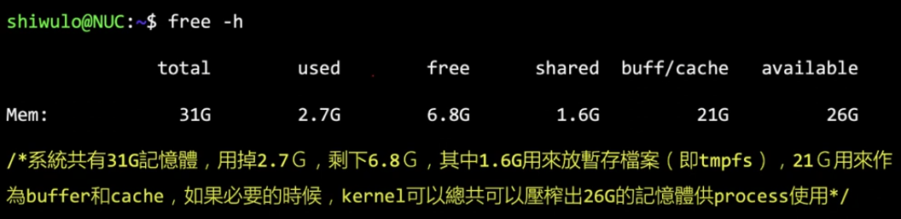{:height="75%" width="75%"}

##### 1.12 Memory and storage consistency

主記憶體採用 DRAM 斷電後失去內容，因此需要非揮發性的第二層儲存裝置(Secondary storage，Disk, SSD)。

-   而電腦必須將第二層儲存裝置的內容載入記憶體後才可以供 CPU 運算
    -   可以透過明確的程式碼存取資料，如: open, read, write
    -   也可以透過 mmap 的方式將檔案 Maping 到應用程式的記憶體空間加以處理
-   程式與 OS 都必須定期的將資料回存到下層裝置
    -   OS 與 I/O 函數庫都可能透過 Buffering 的機制，以批次的方式寫出資料以增加效率
    -   應用程式可以呼叫函數強制將資料寫出，如: sync, fsync, fdatasyc

效能上的考量 read > write，read 不能延遲，延遲將導致程式無法執行。  
結果上的考量 write > read，當使用者使用 Ctrl+S 進行儲存時，若在中途當機資料並沒有真的寫入 Disk，使用者將無法接受。  
write 往下寫入時不一定馬上把資料寫入 Disk，有可能只是先暫時存在 Memory/Buffer 中，同時裝置上可能也會有 Buffer 例如 SSD。
這裡有例如 Write-through，Write-back 等不同方式的寫入是 OS 能進行操作的。

-   **Write-through**: 寫入 Main memory 時同時寫入 Cache 這樣可以保證資料的一致性
-   **Write-back**: 寫入數據時先寫入 Cache，並將資料標記為 `dirty`(已修改但未寫回主記憶體)，然後在稍後的時間點將資料寫回記憶體，例如: Cache 需要新的空間來儲存新的數據

> 深入思考，如果裝置上能有電池的話就能保證寫入時部份的安全性，如果已經寫入裝置上的 Buffer 此時電源出現意外也能短時間內進行儲存

> 延伸閱讀: [Write-through vs Write-back]

##### 1.13 Linux base file system management

-   九字檔案權限管理，分為檔案與資料夾，詳情可看鳥哥的介紹 [第七章、Linux 磁碟與檔案系統管理] 
-   Linux 的檔案系統支援 ACL(Access control list)
    -   ACL 可以對各個使用者或各個群組分別設定權限
    -   ACL 依賴底層的檔案系統支援，如: EXT4, BTRFS 等都支援 ACL
    -   可以使用指令 `setfval` 與 `getfacl` 分別設定及讀取檔案或目錄的權限

> 但是有時後 Normal user 也需要更改權限來執行某些程式，例如: **passwd**, 他會在執行中使用 **setuid** 來暫時改變使用者權限，
> 直到 **passwd** 執行結束(或者是該程式放棄 root 權限)
{: .block-tip }

Computer world 中的權限往往與現實世界的權限不相等

-   Linux 中 root 擁有最高權限，root 可以對檔案系統、應用程式(記憶體)進行各式樣的操作
-   root 可以存取所有使用者的檔案(甚至是機密檔案)，這與真實的權限不符合(老闆 = Normal，系統管理者 = Super)
-   目前大部分的 Linux 提供資料夾加密的功能，可以部分改善問題

### I/O Subsystem

[1.14 I/O Subsystem & Control](./2023-09-12-operating_system_introduction.html#114-io-subsystem--control)  
[1.15 I/O Subsystem transfers data](./2023-09-12-operating_system_introduction.html#115-io-subsystem-transfers-data)  
[1.16 CPU and DMA compete for memory access](./2023-09-12-operating_system_introduction.html#116-cpu-and-dma-compete-for-memory-access)  

##### 1.14 I/O Subsystem & Control

周邊裝置可能有不同儲存資料的方式，例如滑鼠鍵盤可能僅需要內建暫存器，而網路卡、硬碟可能有自己的內部記憶體，儲存的資料與周邊的晶片來運作裝置。
**I/O Subsystem** 是 OS 的一個重要部分，負責管理程式的 I/O 請求。

**I/O Subsystem** 的控制流程通常如下:
1.  向周邊下達命令
2.  於記憶體及周邊之間做資料傳輸
3.  通知處理器「工作已完成」

**[Memory mapped I/O](MMIO)**  
目前主流使用的 I/O 方式
-   將周邊的控制「暫存器、記憶體」映射到 CPU 的「記憶體映射空間(Memory space)」
-   例如使用指令: `MOV CX, 0xFFFFFFFF;` 假設 `0xFFFFFFFF` 是裝置記憶體，將 CX register 的值放到位置 `0xFFFFFFFF` 就等於向下儲存資料

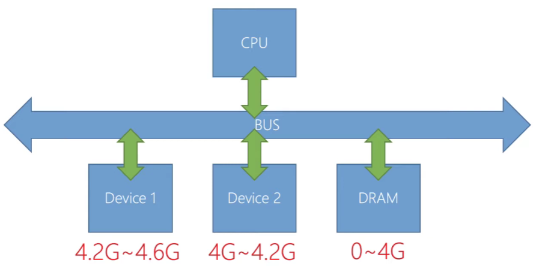{:height="75%" width="75%"}

> 上圖模擬一個可能的 MMIO，DRAM 與不同的 Device 分別被映射到不同的記憶體區段。裝置有自己的控制暫存器、
> 去設定讀取的指令來在裝置的晶片上執行，在裝置暫存器讀寫的程式就被稱作**(Device driver)驅動程式**

**[Port mapped I/O](PMIO)**  
目前在一些嵌入式處理器上使用，因為 x86 是較古老的架構因此也有支援 PMIO
-   使用特別的指令，將資料傳輸到特定的「Port」，注意: Port 和 Memory space 是分開的定址空間
    -   x86-32 的 I/O Port 的定址空間只有 0~65535
    -   x86-32 的記憶體定址空間只有 0~4G
-   使用的指令形式如下:
    -   `out 0x255, AX;` 將 AX register 寫到 0x255 Port，對裝置寫入資料
    -   `in AX, 0x100` 從 0x100 Port 將資料寫到 AX register，將裝置資料取回

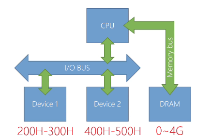{:height="75%" width="75%"}

> Device、Memory 分別用不同的定址方式，I/O Bus 為 64K 即最多 65536，Memory 則可以到最大 4G，這種架構下指定的速度通常比較慢，因為 MMIO 可以更簡單與直接的進行 I/O。

> 延伸閱讀 [I/O對應的方式]

##### 1.15 I/O Subsystem transfers data

傳輸資料上，一般來說不會使用 CPU 進行，因為 CPU 要做更重要的事。**DMA(Direct memory access)** 是相對簡單的硬體，
專門用來做**主記憶體對主記憶體的傳輸**或**裝置記憶體對主記憶體的傳輸**。
-   簡單的 DMA 只要計數器，被搬移資料的開始位置，要搬入資料的開始位置，這樣三個 Register 就完成一個能搬移連續資料的 DMA
-   DMA 可以屬於 Bus 的一部分，如: ISA，或者是裝置的一部分，如: PCI

**(DMA and Cache)Coherency problem**

只要有兩種介面存取同一個儲存裝置就一定會有如何同步的問題

-   DMA 直接存取記憶體，但 CPU 透過 Cache 存取記憶體，這造成資料不一致(Cache 的資料一定比 Main memory 新)
    -   從記憶體寫出資料到裝置時，必須將 cache 的資料 flush 到記憶體(寫入主記憶體)
    -   從裝置讀取資料到記憶體時，必須先 invalid 相對應的 cache line
-   Alignment
    -   DMA 傳輸的資料的開始及結束位置，通常要和 Cache(Cache line) 和 Memory 的寬度進行對齊
    -   這部分的限制可能來自於 DMA Controller 直接將資料以「固定的大小」更新到 Cache。例如: x86 是 64 個 Byte，那傳輸資料就跟 64 Byte 對齊。*硬體在這裡沒有特別做處理，使得非對齊的資料也可以部份更新*

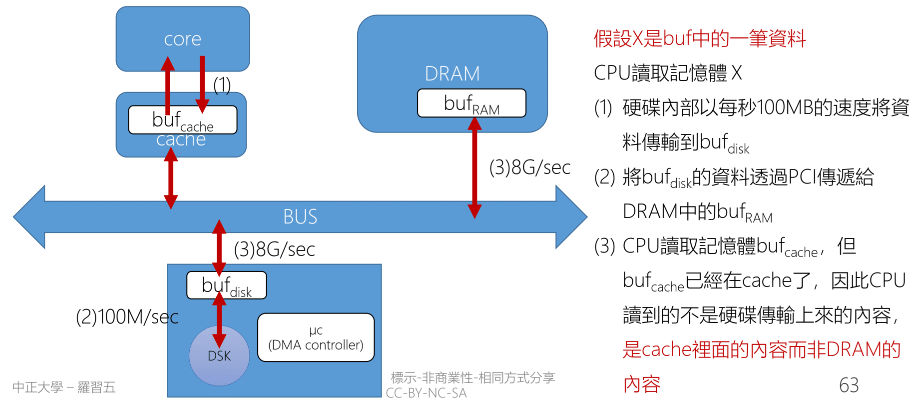{:height="100%" width="100%"}

> Disk 與 DRAM 之間的交換也要使用 buffer 來進行交換，才能避免低速讀寫去占用寶貴的 Bus 資源。當 bufdisk 將資料傳給 bufRAM 後此時要處理的就是 bufcache 與 bufRAM 之間的一致性

**Cache 與 DMA 的資料不一致性解決之道**

-   (DEV => CPU) 使用硬體解決，硬體自動會將 DMA 的傳輸更新到 Cache 內(Cache coherence algorithm)
    -   某些處理器，例如早期的 ARM 處理器，這部分需要特別的指令設定該段記憶體的「屬性」
    -   例如直接將該段資料直接從 cache 上完整移除(flush)，這樣就能確保 CPU 讀取記憶體時從 Main memory 讀取
    -   用硬體來進行處理的話可以分段去處理，這樣就能在分段中偷偷傳輸資料，總有一些 Cycle 沒有被使用
-   (CPU => DEV) 設定讓 CPU 在該記憶體區段進行寫入時，使用 Write through 或 Noncacheable，直達裝置上的記憶體
    -   **Noncacheable**: 直接將資料寫入該段記憶體而不透過 Buffer，這樣能確保 DMA 的資料是最新的，但會降低效能。

> 延伸閱讀 [Cache和DMA一致性]

##### 1.16 CPU and DMA compete for memory access

-   如果 CPU 發生 **Last-level-cache(LLC) miss** 時，CPU 可能會合 DMA 爭奪存取權:  
    -   如果 CPU 訪問 LLC 時，如果發現沒有所需要的數據，CPU 可能會嘗試直接存取 Main memory，若此時 DMA 也正在進行存取，
    就會產生爭奪存取權。
    -   DMA 每次都只傳輸小量資料，那就可以很快的禮讓控制權給 CPU，但這樣的傳輸模式很沒效率
    -   DMA 做大量傳輸可以提升 I/O 的效能，但可能會造成 CPU 等待 DMA 完成傳輸而閒置

> 延伸閱讀 [Burst mode]

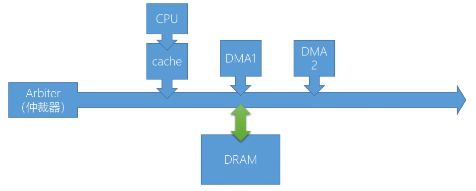{:height="100%" width="100%"}

-   目前在 PCI 上每個 Device 都有自己的 DMA
-   [Arbiter] 用來分配不同的 Device 的存取權，通常是速度越快的裝置優先權越高

**DMA 的其他議題**

-   DMA 的定址空間
    -   部分 DMA 的定址空間可能只有 32bit，OS 必須盡可能的將 DMA 能使用的記憶體保留給 DMA 使用
-   I/O MMU
    -   主要讓 DMA 存取實體位置不連續的記憶體
    -   避免惡意的裝置或驅動程式
-   DDIO (Data Direct I/O)
    -   在某些 Intel 平台上，DMA 的傳輸可以跳過 DRAM 直接傳輸到 cache，例如: Xeon, DDIO
    -   例如 ARM 上的 ACP(Access to Shared Caches)，即使用 DMA 對這個裝置進行操作，
    其內容也會被同步到 cache memory 裡面，包括 L1 和 L2 cache

> Access to Shared Caches vs. Traditional methods

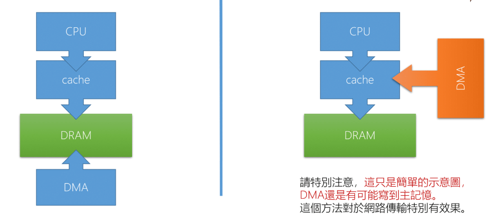{:height="100%" width="100%"}

### I/O Subsystem notify the CPU

[1.17 Interrupt hardware concept](./2023-09-12-operating_system_introduction.html#117-interrupt-hardware-concept)  
[1.20 Interrupt vector table](./2023-09-12-operating_system_introduction.html#120-interrupt-vector-table)  
[1.21 Interrupt Service Routine](./2023-09-12-operating_system_introduction.html#121-interrupt-service-routine)  
[1.22 Bottom half](./2023-09-12-operating_system_introduction.html#122-bottom-half)  
[1.23 Bottom half and Top half](./2023-09-12-operating_system_introduction.html#123-bottom-half-and-top-half)  
[1.24 Polling](./2023-09-12-operating_system_introduction.html#124-polling)  
[1.25 Buffering](./2023-09-12-operating_system_introduction.html#125-buffering)  

OS 交付工作給周邊裝置後，於工作完成後通知 CPU 的方法可以使用:
-   Interrupt
-   Polling
-   Interrupt + Polling 

##### 1.17 Interrupt hardware concept

Interrupt 是一種改變程式正常執行流程的機制，可以由 Device 或者 CPU 本身產生

-   Legacy Interrupt
    -   由實體線路構成，每個裝置連接到實體的中斷線，中斷線連接到 Programmable interrupt controller(PIC, 可程式化中斷控制器)，PCI 再向 CPU 的 INT 腳位發出中斷訊號
    -   PC 中斷線也就共 15 條，但是 Device 通常不只 15 個，因此必須數個裝置共用一條中斷線
-   Message Signaled Interrupts
    -   所有 Devices 共用一組中斷線路，裝置在中斷線路上寫入自己的中斷編號，就會觸發 CPU 中斷
    -   這樣就類似在一條線上傳輸編碼，經過解碼器後推向 CPU，讓 CPU 對自己送出中斷，例如: PCI 的 MSI-X 支援 2048 個中斷編號

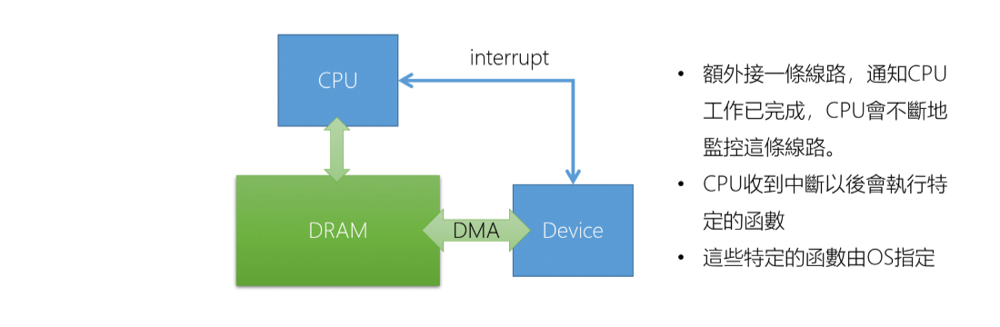{:height="100%" width="100%"}

> CPU 會設計好 IVT 的位置，由 OS 放入適當的 ISR 這部分也是驅動程式(Device Drver) 的一部分

##### 1.20 Interrupt vector table

-   Interrupt 處理流程:
    1.  Interrupt Request: 當中斷請求發生時，將所有中斷 Disable，將 CPU 切換到 Kernel mode
    2.  Store State: 暫停目前的 Process 並保存此 Process 的執行狀況
    3.  Interrupt Vector Table: OS 根據 Interrupt ID 查詢 IVT，並取得 Interrupt Service Routine 的開始位置
    4.  Interrupt Service Routine: 執行 ISR
    5.  Restore State: 恢復之前 Process 的執行狀況
        -   這時候不一定恢復原本的 Process，因為 System call 可能改變 Process 的狀態，由 Scheduler 來決定下一個執行的 Process(不一定是原本的 Process)

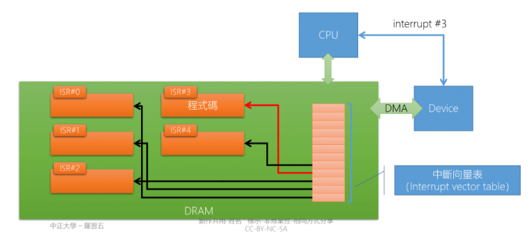{:height="100%" width="100%"}

-   IVT 放置的是 ISR 的開始位置
    -   ISR 開頭都是用組語寫的，如果 C 的執行環境設定好也可以用 C

##### 1.21 Interrupt Service Routine

發生 Interrupt 時是 Disable Interrupt，但在 ISR 的時候可以視情況決定是否要 Enable Interrupt，要允許哪寫 Interrupt，如果再 ISR 中 Enable interrupt 表示允許巢狀中斷(Nested Interrupt)

-   Nested Interrupt: 「一個中斷，被另一個中斷給中斷」

Linux 中，ISR 只處理必須立即處理的部分，剩餘的部分交由 Kernel thread 處理。例如: ksoftirqd

-   ISR 中不能呼叫任何會造成「wait」的函數，例如: semaphore 中的 `wait()`
    -   從設計上 `wait()` 的主體是 task (can context swtich)，ISR 只是一個有自己堆疊的函數，不是 task
    -   從邏輯上 ISR 是處理 I/O 中的「必要部分」(緊急性)，因此不應該 `wait()`
    -   如果程式邏輯上必須要 `wait()`，就要考慮是否把這部分留給 Bottom half 解決

##### 1.22 Bottom half

Bottom half 可以分為三種 softirq, tasklet, work-queue
-   **Softirq** 可以在多個 CPU 上平行運行，必須在編譯時靜態註冊
-   **Tasklet** 是建立在 softirq 之上的一種機制，tasklet 可以動態註冊和銷毀，相同類型的 tasklet 不能在多個 CPU 上同時運行
-   **Work-queue** 是一種完全不同的機制，work-queue 可以確保同一種類型的 driver 只會在同一個 CPU 上運行
從效能高低上是從左往右排序，從易寫程度上是從右往左排序

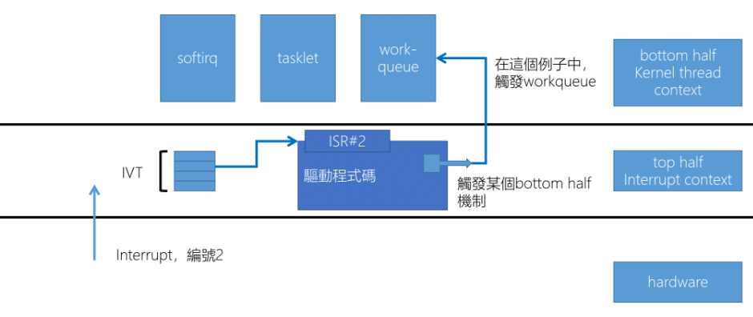{:height="100%" width="100%"}

-   理論上這三個都應該由 Kernel thread 來呼叫
    -   如果是 Kernel thread(task) 那就可以 wait()
-   實際上 softirq, tasklet 在 Linux kernel 可以由 Linux kernel 提供的一小段程式碼在 ISR 結束時呼叫
    -   這樣的話他是執行在 ISR 中，這樣是不能 wait()

會設計成 ISR 也可以呼叫的原因是，如果這次 ISR Loading 並不重的時候就乾脆全部的工作都在 ISR 完成，這樣的消耗會比呼叫 Kernel thread 更少

在 [Driver Architecture](./2023-09-12-operating_system_introduction.html#driver-architecture) 篇章會更詳細的說明

> ksoftirqd 最多寫 32 個驅動程式在裡面，只有高速裝置會掛在 ksoftirqd 例如: Network Card

> 延伸閱讀: [Difference between SoftIRQs and Tasklets], [tasklet, taskqueue, work-queue -- which to use?]

##### 1.23 Bottom half and Top half

> Bottom half 的 softirq 每個 Core 就只有一個 `ps -e | grep softirq`

在這裡 Top half, Bottom half 分別指的是:
-   **Top half**: 是指來立刻響應的 Interrupt 時處理的中斷函數，在這個階段執行快速且必要的硬體操作，如: 保存狀態，和呼叫 Bottom half
-   **Bottom half**: 跟 Top half 的區別是執行期間 Interrupt 是啟用的

這裡進入 Bottom half 的工作會被包裝成一個 Struct 兩個 Pointer，包含 Function, Data，然後將這個 Struct 加入一個 Linked list，
之後等待 CPU 有空閒時 softirq 會從中取出 Struct 來執行 Bottom half。

-   **Function pointer**: 該函數定義了 Bottom half 實際的執行工作，包含: 處理資料，啟動另一個 I/O 等等
-   **Data pointer**: 指向工作相關的資料，硬體的資料，要計算的參數，需要修改的 Memory 等等

在 Linux 中，當 top half 決定將一些工作推遲到 bottom half 時，這些工作會被包裝成一個結構，該結構包含兩個指標：一個函數指標和一個資料指標¹。

##### 1.24 Polling

> 如果系統的 Loading 很輕，並且系統請求的時間比較沒規則時 Interrupt 會比較好，但如果負載高 Interrupt 被不斷的送出，
> 這樣可能會導致 CPU 不斷的去處理 Interrupt，此時 Polling 會比較好

-   與 Interrupt 不同，Polling 是 OS 每隔一段時間主動去探詢裝置的狀態
-   如果數個 Device 共用同一條 Interrupt 那麼當 Interrupt 發生時，OS 必須
-   某些裝置同時支援 Interrupt 和 Polling，例如: Network Card，可以在負載量高/低時做切換

> 像滑鼠跟鍵盤就通常是採用 Polling，除非有特殊需求，例如: 電競滑鼠

##### 1.25 Buffering and Kernel bypass

1.  read(fd, buf, 200) 會用掉四個 Register
    -   read(): 本身就是參數(No. 3 Interrupt, $AX 要設定為 3)
    -   fd: 從哪裡讀資料
    -   buf: buffer 的起始位置，200 Buffer size
2.  read 呼叫後 Kernel 會配置 krl_buf，DMA 傳輸會將資料從 dsk_buf 搬移到 krl_buk
3.  最後由 Kernel 將資料 Copy 到 Userspace

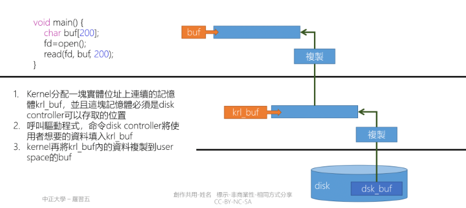{:height="100%" width="100%"}

-   **Kernel bypass**: 是指不需要透過 Linux kernel 的功能，使用自己實現的相同功能的程式碼直接將 Device 的資料 Copy 到 Userspace
    -   這可以幫助解決在高 concurrent 下由於 Interrupt Handling, Memory Copy, Context switch, Locality miss, 
    CPU Affinity, Memory Management 所造成的性能瓶頸
    -   代表的技術有 DPDK, eBPF 等等

> 延伸閱讀: [kernel-bypass 内核旁路技术介绍]

### Scheduler and File System

##### 1.26 Process and Thread of Linux

-   在 Linux 提供下列 System call
    -   fork(), vfork() 產生 Process
    -   clone() 產生 Task(Process, Thread)
    -   execve() 將一個執行檔內的程式載入該 Task 中
-   對 Linux 來講 Process, Thread 都是 Task
    -   Linux 使用 Task struct 來描訴 Process, Thread
    -   Process, Thread 的差異只是「共享資源的多寡」，尤其是記憶體是否共用
    -   fork, vfork, clone 都是呼叫 Kernel 中的 do_fork
-   有一些 Thread 只執行於 Kernel mode，Linux 稱為 Kernel thread

##### 1.27 Scheduler

> 如果只說 Scheduler 通常指的是 CPU Scheduler

-   傳統上 Scheduler 希望達成以下目標
    -   依照優先權賦予優先權的公平性
    -   所有的 Task 都可以在合理的時間內，再次獲得 CPU 使用權
    -   優化 I/O 效能，例如: 處理 I/O 的設備可以先執行，接下來工作交給 I/O 設備
-   Linux 更進一步的達到以下目標
    -   Multi-core 上能做到 Load balance
    -   Scheduler 本身不至於造成 Multi-core 的效能瓶頸 
    -   對多媒體、遊戲有更好的支援，CFS
-   Linux 還未達到的目標
    -   Real-time system 的支援
    -   Linux 在手機上的 Scheduler 比 iOS 的 Scheduler 更耗電(iOS 並不是真正的多工 OS)

##### 1.28 File system

> 在檔案系統要注意到這些: 新技術如： SSD、管理的問題(大檔案、零碎檔案)、存取行為(循序/隨機存取)、檔案的重複性問題、混合硬碟(SSD\HDD)

-   Linux 使用 Virtual file system(VFS), 兼容多種檔案系統，大部分這些檔案系統都使用「**[i-node]**」的概念描述檔案
    -   **[i-node]**: 用於描述檔案或目錄，裡面儲存資料的屬性和位置，例如: 所有者、許可權、大小、最後修改時間等
    -   **[VFS]**: 透過統一的介面，使無論底層的檔案系統是什麼，都能透過介面處理，例如: open(), read(), write()
    -   **[File system]**: 用於管理底層裝置資料存取的機制，例如: ext4, NTFS, FAT32 ...
-   Linux 官方的 File system 是 ext4'
    -   **ext4**： 是 Journaling file system，因此當發生意外，檔案系統不至於完全損毀，並且能快速恢復(fsck.ext4)
-   Linux 支援 **[btrfs]**，btrfs 借用了 zfs 的很多概念，主要包括:
    -   snapshot, copy-no-write, hot plugging HDD/SSD, difference disk load balance, backup support

### Hardware progress

[1.29 SMP and CMP](./2023-09-12-operating_system_introduction.html#129-smp-and-cmp)  
[1.30 Single-ISA heterogeneous multi-core](./2023-09-12-operating_system_introduction.html#130-single-isa-heterogeneous-multi-core)  
[1.31 UMA and NUMA](./2023-09-12-operating_system_introduction.html#131-uma-and-numa)  

-   目前已經很難提升 CPU 的 Clock
    -   相同架構下，提升 Clock 是最直接方式來的提升 Performance
    -   提高 Clock 會遇到大量的熱，也是提升效能的瓶頸
-   Processor, Menory, Storage 等等藉由不斷的「複製，貼上」產生平行運作
    -   平行運作往往需要軟硬體結合
    -   很多時候，硬體提供「多種選擇」給軟體進行優化

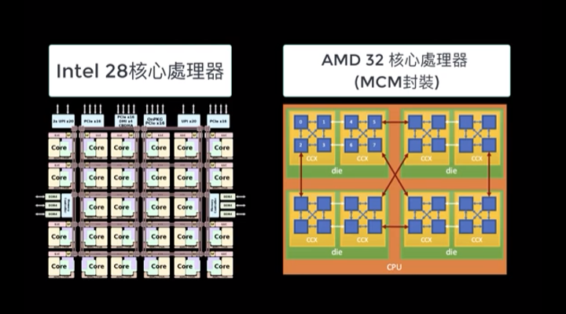{:height="100%" width="100%"}

> 寫平行化程式，程式碼每年可以有 23% 的效能提升，否則只有 4.6%

平行處理架構指的是「同時使用多個 Process(Core)」例如: PC 常見的 Multi-Core Process
**他的優點**:
-   提高產能: 在工作可以平行化時，產能將以倍數提升
-   成本考量: 相較於高時脈的 Processor，工作平行化後，數個時脈低的 Processor 能得到一樣的效果
-   增加可靠度: 高階伺服器可以提供 Processor, Memory 熱插拔的功能，例如: Linux, 可以在不停機的情況下更換 CPU

##### 1.29 SMP and CMP

-   *[Symmetirc multiprocessor]*(SMP, 對稱多處理)
    -   每個 Processor 的地位是等價的，應用程式可以在這些處理器上做轉移(migration)
    -   在這個架構上所有 Processor 都共享一個共同的 Main memory，有可能會導致記憶體存取衝突而影響效能
-   *[Chip multiprocessor]*(CMP, 單晶片多處理) 也稱作 **Multi-core**
    -   將多顆 (Core)Processor 集成至一顆晶片
    -   每個 Core 都有自己的 Cache 可以減少對共用 Memory 的存取需求
    -   共享最下層的 Last level cache(LLC)，因此不同 Core 之間的轉移比較快速
-   *[Simultaneous multithreading]*(SMT, 同步多執行緒)
    -   在一顆 Processor 上用硬體模擬出 N 顆 Process，硬體的主要成本是 Logical register 數量增加 N 倍
    -   能更有效的利用 Processor 內部的 Function unit，如: 加法器，乘法器等

> Intel 宣稱他們實現的 SMT(Hyper-threading) 增加 5% 的晶片面積，可以獲得 15% ~ 30% 的效能提升  
> AMD 於 2017 推出的 Zen CPU 也實現了 SMT

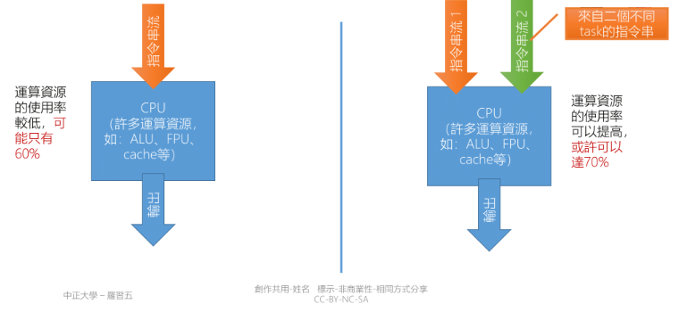{:height="100%" width="100%"}

> 上方右圖有兩個 Instruction flow(Register set) 去競爭資源，例如: Floating point unit, Adder, Loader, Storer  
> SMT 不是去增加系統的速度，是增加系統的使用率，前提是有足夠的 Task 跟進行的運算可以 [Loop unrolling]，  
> 例如: Fibonacci 因為每次都必須算出前一個數字才能繼續後面數字的運算  
{: .block-warning }

> 延伸閱讀: [Algorithm Efficiency - Is partially unrolling a loop effective if it requires more comparisons?]

###### 1.30 Single-ISA heterogeneous multi-core

-   在學術上是多個處理器，這些處理器使用同樣的指令集，但是處理器的內部設計(Micro-Architecture)不同
    -   例如: Clock，Pipeline depth，Funciont unit number
    -   有些程式指令平行度高，適合 Pipeline、Superscalar
    -   有些程式指令平行度低，適合 In-order issue、High clock processor
    -   因 Instruction set 相同，OS 可以幫合適的 Task 挑選適合的 Processor
-   ARM 上實現的 Big-Little 架構是上述的一個實現
    -   雖然 Processor 運算速度不同，但其 Instruction set 相容
    -   OS 可以依照需求使用高效能 Processor(Big) 或省電型 Processor(Little)

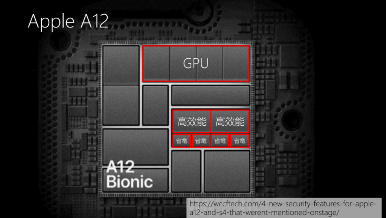{:height="100%" width="100%"}

> 在 Big.Little 中可以做 Task migration，這部分是 OS 跟 Programmer 需要去考慮的

-   SMT 是由 DM Tullsen, SJ Eggers, HM Levy 所提出
    -   Simultaneous multithreading: Maximizing on-chip parallelism, ISCA, 1995.
    -   Intel 於 2002 實現這個構想，並將它稱之為 hyperthreading
-   Big.LITTLE 的概念由 R Kumar, KI Farkas, NP Jouppi, P Ranganathan, DM Tullsen 提出
    -   Single-ISA heterogeneous multi-core architectures: The potential for processor power reduction, MICRO, 2003.
-   更厲害的是：這二個架構的創想來自於同一個實驗室
    -   https://cseweb.ucsd.edu/~tullsen/

##### 1.32 UMA and NUMA

-   目前為止(2018)所使用的 Processor memory architecture 大部分為 **[Uniform memory access]**(UMA)
    -   大致上可以說: 每個 Processor 存取任何位置的 Memory 的速度都是相等的
    -   UMA 架構使用一套記憶體插槽，也就是共享 Memory bus
    -   對於 UMA Processor 而言，當 Processor 增加時，記憶體頻寬是效能瓶頸所在(Intel core i9 是有 18C36T 的 UMA Processor)
-   **[Non-Uniform memory access]**(NUMA)
    -   傳統上是插兩個以上的 CPU，如部分機架式伺服器: HP DL380 Gen7
    -   AMD 的 threadripper 將兩顆 CPU 封裝在一起，threadripper 上可以看到兩個 DRAM 插槽
    -   對 NUMA 來說記憶體分為 Local, Remote，存取 Local 時的速度會較快

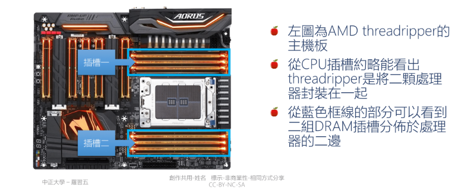{:height="100%" width="100%"}

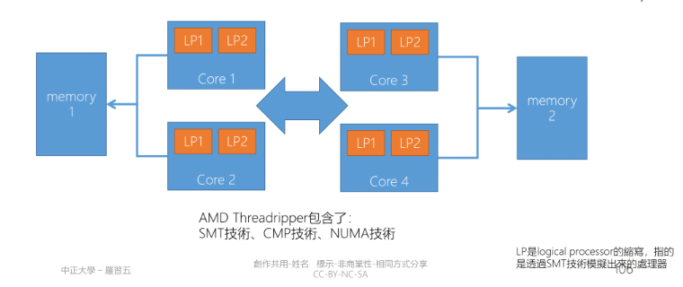{:height="100%" width="100%"}

> 這樣的做法兩邊都會有獨立控制的 Memory bus，避免了部分的記憶體頻寬的效能瓶頸

### Driver Architecture

Driver 中可延遲處理(Bottom half) 的形式就分成三種，這部分在 [Bottom half](./2023-09-12-operating_system_introduction.html#122-bottom-half) 簡單提過:

-   softirq(軟中斷)
    -   softirq 支援 SMP，同一個 softirq 可以在不同的 CPU 上同時運行，softirq 必須是 **[Reentrancy]**(可重入的)
    -   softirq 是在編譯期間靜態註冊，不像 tasklet 那樣能被動態註冊或去除
    -   HI_SOFTIRQ, TIMER_SOFTIRQ, NET_TX_SOFTIRQ, NET_RX_SOFTIRQ, SCSI_SOFTIRQ, TASKLET_SOFTIRQ
    -   基本原則是使用在高速裝置或該裝置不能被延遲，如: Network RX/TX, Timer inputerret, Disk, **tasklet**

softirq 在 Kernel 編譯是就已經定義、註冊好，通常是不會去做改寫。會使用 softirq 的原因主要是因為發現 I/O 的效能瓶頸是在 CPU，
前提是要有足夠的 Processor。

-   tasklet
    -   tasklet 不允許兩個相同類型的 tasklet 同時執行，即使在兩個
-   work-queue
    -   由 Kernel theard 來實現，所以可以被 context switch(前兩種只能被 ISR 打斷)
    -   適合需要長時間執行，或需要 seelp
    -   默認可以被 Interrupt，不持有任何 Locked

> 延伸閱讀: [V-Softirq in Linux Device Driver – Linux Device Driver Tutorial], [Linux softirq, tasklet, workqueue]

**下面是 Interrupt 離開時觸發 softirq 的流程與程式碼**:

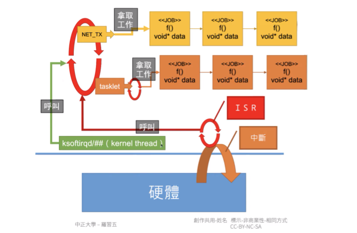{:height="75%" width="75%"}

ksoftirq 是在 Kernel thread 會去呼叫 Loop，這個 Loop 會不斷去拿工作來做，這個 Loop 可以被 ISR 或 ksoftirqd 呼叫，
如果是由 ksoftirqd 呼叫那就可以 sleep，但如果是由 ISR 呼叫 Loop 則是執行在 Interrupt context 那就不能 sleep。
-   會設計 ISR 可以呼叫 Loop 的原因是 Linux 為了優化，如果 Interrupt 所觸發的工作並不多，就乾脆在 ISR 中處理完
-   若是由 ksoftirq 呼叫就會讓 Interrupt 先結束，後續讓 Scheduler 來安排 Task 進行工作

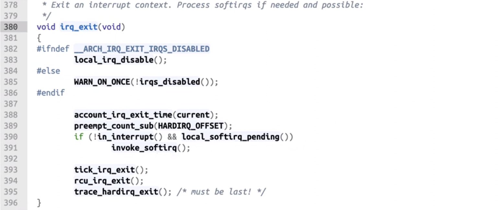{:height="75%" width="75%"}

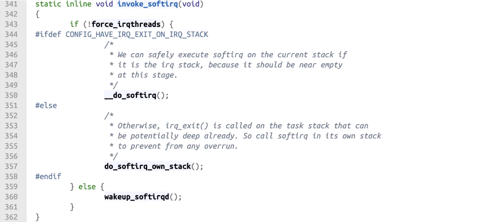{:height="75%" width="75%"}

-   `invoke_softirq()` 會去 Loop 中拿取工作來執行
    -   `force_irqthreads` 用這個變數來判別是 Interrupt context 呼叫還是 Kernel thread
    -   `__do_softirq()`, `do_softirq_own_stack()` 都是去執行 softirq，差異在 IRQ STACK 詳細可見延伸閱讀
    -   `wakeup_softirqd()` 則是叫醒 ksoftirqd 把剩下的工作交給 ksoftirqd 來排程

> 延伸閱讀: [Linux kernel的中断子系统 softirq]

**相較於 softirq, work-queue 的流程單純很多，不會運行在 Interrupt context:**

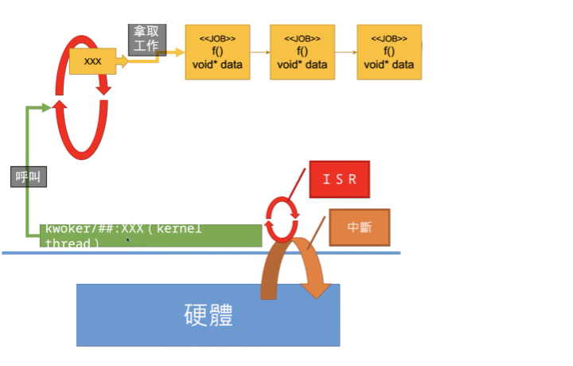{:height="75%" width="75%"}

**General rules for driver writing**

共用的資料跟誰共用，雙方是否會同時執行:
-   會: 就要使用 spinlock(Mulit-Processor)、semaphore(Signle-Processor)
-   不會，那要注意是否會 Preempt:
    -   誰會 Preemmpt 誰
    -   如果單一方向如 A Preempt B，B 去 Disable A 就不會有 Rest condition，例如: Scheduler, Local IRQ, Bottom half
    -   如果是雙向的 Preempt 那就是會同時執行
-   要很清楚程式中隱藏的意思
    -   例如: malloc 是否會造成 Context switch, write 會做 I/O 動作會不會 Context switch

### Start the OS

##### 1.33 Start the OS

> 為什麼不能直接從 Disk 啟動 OS，這是因為 Disk 也需要 Driver 來啟動

-   CPU 能直接控制 DARM, ROM 是因為這兩者都是 Byte address
    -   CPU 只要在 Address bus 上放入要讀取的資料的 Address 就能從 Data bus 上讀取想要的資料
-   Disk 屬於 Block device 需要下達命令告訴 Disk 需要第幾個 Block，之後 Disk 再講 Block 寫到軟體指定的位置，如： (ATA-8, [ATAPI])

如果沒有軟體驅動的情況下 CPU 無法直接讀取 Disk，因此需要在 PC 架構中在 Boot rom 中放入「BIOS」，
BIOS 的重要目的就是讀取 Disk 上的 [Boot sector]。

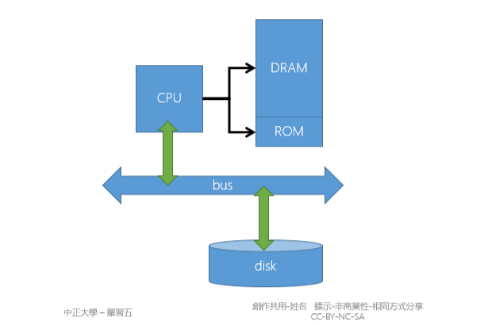{:height="50%" width="50%"}

**Bootstrap**

1.  BIOS(ROM) 讀取 Boot sector(通常是 Disk 上的第 0 個 Block)
2.  BIOS 會帶起來的是 GRUB(Boot loader)，現在也可以從 BIOS 使用 UEFI(BIOS 也認得 OS)
3.  如果帶起的 OS 是 Linux 那麼就必須把開機相關的檔案放在 /boot 下，並且 GRUB 認得該目錄使用的檔案系統
4.  Linux kernel 先掃描裝置狀態，根據裝置狀態配置記憶體(Virtual memory layout)，之後再啟動 Cache
    -   先設定 Virtual memory 是因為這裡必須將映射到 I/O 的部分設定為 Non-cached
5.  Linux kernel 啟動後，啟動第一個 User space 的程式，傳統上是 init，也有許多 Linux 改用 systemd，他們的 pid 都是 1，
負責 Linux 後續的初始化

> 這裡是因為對應 I/O 的區段(例如: DMA)，不希望這些操作被 Cache，如果被 Cache 可能會導致資料不一致，因此要先設定 Non-cached

**BIOS limitations**

-   BIOS 必須要認得 Disk 上的開機 Block，如果 BIOS 不支援該 Disk，將無法啟動 OS(例如: 容量超過 BIOS 的定址範圍)
-   BIOS 內含多種驅動程式，例如要支援 USB
    -   大部分 BIOS 不支援藍芽裝置，因此開機時的藍芽滑鼠，鍵盤等等都不能與 BIOS 互動

> ##### Last Edit
> 10-09-2023 18:27
{: .block-warning }

[Virtual memory]: https://en.wikipedia.org/wiki/Virtual_memory

[Linux Signals]: https://devopedia.org/linux-signals
[Interruption of system calls when a signal is caught]: https://unix.stackexchange.com/questions/16455/interruption-of-system-calls-when-a-signal-is-caught

[Write-through vs Write-back]: http://thebeardsage.com/write-through-vs-write-back/

[第七章、Linux 磁碟與檔案系統管理]: https://linux.vbird.org/linux_basic/centos7/0230filesystem.php

[Memory mapped I/O]: https://en.wikipedia.org/wiki/Memory-mapped_I/O_and_port-mapped_I/O
[I/O對應的方式]: https://stenlyho.blogspot.com/2008/08/io.html

[Cache和DMA一致性]: https://zhuanlan.zhihu.com/p/109919756

[Burst mode]: https://en.wikipedia.org/wiki/Burst_mode_(computing)
[Arbiter]: https://en.wikipedia.org/wiki/Arbiter_(electronics)
[Difference between SoftIRQs and Tasklets]: https://stackoverflow.com/questions/7137209/difference-between-softirqs-and-tasklets
[tasklet, taskqueue, work-queue -- which to use?]: https://stackoverflow.com/questions/14982589/tasklet-taskqueue-work-queue-which-to-use
[kernel-bypass 内核旁路技术介绍]: https://zhuanlan.zhihu.com/p/630976564    

[Overview of the Linux Virtual File System]: https://www.kernel.org/doc/html/latest/filesystems/vfs.html
[i-node]: https://en.m.wikipedia.org/wiki/Inode
[VFS]: https://en.m.wikipedia.org/wiki/Virtual_file_system
[File system]: https://en.m.wikipedia.org/wiki/File_system
[btrfs]: https://zh.m.wikipedia.org/zh-tw/Btrfs

[Symmetirc multiprocessor]: https://en.m.wikipedia.org/wiki/Symmetric_multiprocessing
[Chip multiprocessor]: https://en.m.wikipedia.org/wiki/Multi-core_processor
[Simultaneous multithreading]: https://en.m.wikipedia.org/wiki/Simultaneous_multithreading

[Loop unrolling]: https://en.m.wikipedia.org/wiki/Loop_unrolling
[Algorithm Efficiency - Is partially unrolling a loop effective if it requires more comparisons?]: https://stackoverflow.com/questions/8171141/algorithm-efficiency-is-partially-unrolling-a-loop-effective-if-it-requires-mo

[Uniform memory access]: https://en.m.wikipedia.org/wiki/Uniform_memory_access
[Non-Uniform memory access]: https://en.m.wikipedia.org/wiki/Non-uniform_memory_access

[Reentrancy]: https://en.m.wikipedia.org/wiki/Reentrancy_%2528computing%2529
[V-Softirq in Linux Device Driver – Linux Device Driver Tutorial]: https://embetronicx.com/tutorials/linux/device-drivers/softirq-in-linux-kernel/
[Linux softirq, tasklet, workqueue]: https://zhuanlan.zhihu.com/p/361409809
[Linux kernel的中断子系统 softirq]: http://www.wowotech.net/irq_subsystem/soft-irq.html

[ATAPI]: https://en.m.wikipedia.org/wiki/ATAPI
[Boot sector]: https://www.lifewire.com/what-is-a-boot-sector-2625815