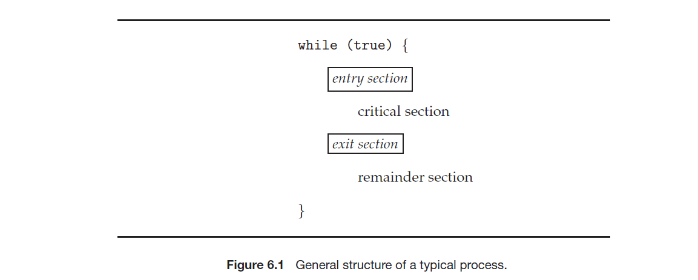
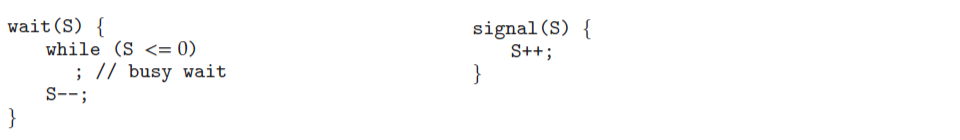
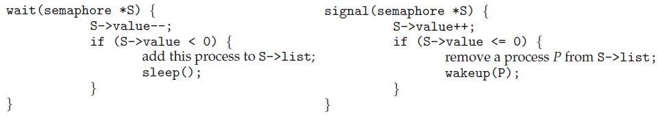

> Operating System: Design and Implementation course notes from CCU, lecturer Shiwu-Lo. 
{: .block-tip }

這個章節主要講的是 Linux 中如果有多個 Task 同時存取記憶體，要怎麼去處理 Synchronization 的問題。

-   多個 Task 如果同時存取 Memory 會發生彼此複寫的問題
    -   同時 Peripheral devices 在 MMIO 中也是一塊 Memory
-   要保護 Memory 最直覺的想法是不要讓會存取同一份 Memory 的 Task 同時執行
    -   設計 Critical Section，避免 Task 同時執行
    -   Critical Section 還必須是有效率，公平的
-   具有啟發性的方法 Peterson's solution
    -   假設 read, write 是 atomic operation
    -   證明 Peterson's solution 滿足 Critical Section 三個條件

> Critical Section 三個條件: Mutual Exclusion, Progress, Bounded Waiting

-   C11 實現 Peterson's solution
-   挑選合適的保護機制
    -   Mutex( /semaphore) = spinlock + sleep + wakeup
    -   預期等待的時間很短，使用 spinlock，例如: (Peterson's solution)
    -   需要等待一段時間，使用 mutex 或 semaphore
    -   上述的 sleep 與 wakeup 在 Linux 中由 system call `futex` 實現

> spinlock 與 peterson's solution 都類似於使用 while loop 來做 busy waiting

-   常見的問題形式
-   Producer-Consumer Problem(生產者與消費者問題)，例如: 驅動程式與周邊設備的溝通
-   Dining Philosophers Problem(哲學家就餐問題)，例如: 多個 Task 之間的資源交換
-   Reader-Writer Problem(讀者與寫者問題)，例如: 只有閱讀檔案而不修改檔案的 Task
-   Multi-Process 同時存取時，要依照哪個 Process 的時間
    -   或者如何保證分散式系統之間也能保證存取的正確性(版本概念)

> 最後討論一些深入的問題

-   從硬體的角度來看 atomic operation 的實現
    -   了解軟體使用的 atomic operation 的代價
-   以 Linux kernel 為例說明應用技巧
    -   多種的 spinlock(C11 實現)，semaphore(以驅動程式為例)
-   更深入的討論 memory order
    -   Atomic 在多處理器上要做到多少的保證

##### 5.1 Multi-Process processing one data at the same time

這裡用一個簡單的例子來說明同時處理一筆資料會產生的問題，可以看到輸出結果並不是我們預期的，這是因為兩個 thread 同時存取 global 變數，造成彼此複寫的問題。

```c
#include <pthread.h>
int global=0;
void thread(void) {
    for (int i=0; i<1000000000; i++)
        global+=1;
}
int main(void) {
    pthread_t id1, id2;
    pthread_create(&id1,NULL,(void *) thread,NULL);
    pthread_create(&id2,NULL,(void *) thread,NULL);
    pthread_join(id1,NULL);pthread_join(id2,NULL);
    printf("1000000000+1000000000 = %d\n", global);
}
// 1000000000+1000000000 = 1037054916
```

使用 `gcc -o exam1.exe exam1.c -g -` 之後使用 gdb 來查看程式碼，使用 `disassemble \m thread` 來反組譯觀察問題在哪，
`\m` 代表把 c 跟 assembly code 一起顯示。

```bash
gdb ./exam1.exe 
(gdb) disassemble /m thread 
Dump of assembler code for function thread:
4       void thread(void) {
   0x0000000000001159 <+0>:     push   %rbp
   0x000000000000115a <+1>:     mov    %rsp,%rbp

5           for (int i=0; i<1000000000; i++)
   0x000000000000115d <+4>:     movl   $0x0,-0x4(%rbp)
   0x0000000000001164 <+11>:    jmp    0x1179 <thread+32>
   0x0000000000001175 <+28>:    addl   $0x1,-0x4(%rbp)
   0x0000000000001179 <+32>:    cmpl   $0x3b9ac9ff,-0x4(%rbp)
   0x0000000000001180 <+39>:    jle    0x1166 <thread+13>

6               global+=1;
   0x0000000000001166 <+13>:    mov    0x2ec0(%rip),%eax        # 0x402c <global>
   0x000000000000116c <+19>:    add    $0x1,%eax
   0x000000000000116f <+22>:    mov    %eax,0x2eb7(%rip)        # 0x402c <global>

7       }
   0x0000000000001182 <+41>:    nop
   0x0000000000001183 <+42>:    nop
   0x0000000000001184 <+43>:    pop    %rbp
   0x0000000000001185 <+44>:    ret

End of assembler dump.
```

假設 global 的初始值為 0，在這個程式中有可能會依照這樣執行，CPU1 做完加法後寫入 %rip，CPU2 也做完加法後寫入 %rip，這樣就會造成彼此複寫的問題。

```bash
CPU1                            CPU2
1.  mov    0x2ec0(%rip),%eax    1.
2.                              2.  mov    0x2ec0(%rip),%eax
3.  add    $0x1,%eax            3.
4.  mov    %eax,0x2eb7(%rip)    4.
5.                              5.  add    $0x1,%eax
6.                              6.  mov    %eax,0x2eb7(%rip)
```

Atomicity 的意思就是當我們在對一個 Data struct 做操作時，要保證整個 struct 是一次性的更新，這裡的 global variable 是一個非常簡單的例子，但是在實際的程式中可能會有很複雜的 Data struct，
因此要保證整個 struct 是一次性的更新是非常困難的。

-   **Definition correct solution**
    -   一個正確的 Multi-thread program 應該要跟其對應的 Single-thread 的 program 有相同的行為

### Critical Section

[5.2 Race condition problem](./2023-11-09-synchronization.html#52-race-condition-probkem)  
[5.3 Critical section three conditions](./2023-11-09-synchronization.html#53-critical-section-three-conditions)  
[5.4 Peterson's solution](./2023-11-09-synchronization.html#54-petersons-solution)  
[5.5 Proof peterson's solution](./2023-11-09-synchronization.html#55-proof-petersons-sol-to-satisfy-critical-section-three-conditions)  
[5.6 C11 implementation](./2023-11-09-synchronization.html#56-c11-implementation)

Critical section 其實就是一套協定，這套協定使多個 Task 之間可以互相合作

##### 5.2 Race condition problem

Race condition(競爭條件)是指軟體系統的行為，當操作是基於無法控制順序的事件或時間，當這些事件沒依照 Programer 意圖的順序發生時，就會出現 bug。

-   Race condition 的其中一種解決方式就是
    -   引入 Critical section，讓 Task 之間互相合作
    -   注意 Critical section 所保護的是程式碼

##### 5.3 Critical section three conditions

1.  Mutual Exclusion(互斥, 基本條件)
    -   如果有一個 Task 在執行 Critical section，那麼其他 Task 就不能執行 Critical section
2.  Progress(進展, 有效率)
    -   如果沒有 Task 在執行 Critical section，只有不在 Remainder section 的 Task 才能決定誰可以執行 Critical section，並且不能無限期的等待
3.  Bounded Waiting(有界等待, 公平性)
    -   如果有一個 Task 想要執行 Critical section，那麼就不能讓這個 Task 被無期限的等待
    -   例如: 有 A, B 兩個 Task，但故意永遠只讓 A 執行 Critical section，這樣 B 就會無限期的等待

{:height="100%" width="100%"}

> libc 其實並沒有滿足 Bounded Waiting 的條件，在某些情況下會造成 starvation

##### 5.4 Peterson's solution

[Peterson's solution] 是一個完全解決 Race condition 的純軟體演算法

-   假設只有 P0, P1 兩個 Task
-   對於硬體有一些基本假設
    -   `read`, `write` is atomic operation
    -   shard memory system
        -   因為假設是 shard memory system，所以無法用在 distributed system
-   Peterson's solution 可以擴展到 N 個 Task

1.  假設 P0, P1 共享兩個變數
    ```c
    boolean flag[2] = {false, false}; /* Represents who wants to enter the Critical section */
    int turn; /* 0 means P0, 1 means P1 has priority when entering the critical area */
    ```
2.  P0 source code
    ```c
    while (1) {
        flag[0] = true;         /* P0 wants to enter the critical section */
        turn = 1;               /* IF P1 wants to enter the critical section, P1 has priority */
        while (flag[1] && turn == 1)
            ;                   /* busy waiting */
                                /* critical section */
            flag[0] = false;    /* exit section */
                                /*remainder section */
    }
    ```
3.  注意 P0 會在 turn 優先讓 P1 進入 Critical section，同樣的 P1 也會在 turn 優先讓 P0 進入 Critical section
    -   對方想進入 Critical section，那麼自己就讓對方進入 Critical section
    -   沒有人想進入 Critical section，那麼就自己進入 Critical section
    -   對方離開 Critical section 後，自己就可以進入 Critical section

##### 5.5 Proof peterson's sol to satisfy critical section three conditions

Proof:
-   **Mutual Exclusion**
    -   Shard memory 中，Task 都能修改 turn, 所以 turn 只會有兩個值，0 或 1
    -   `write` 必須是 atomic operation，否則 P0, P1 有可能讀到不同的值
-   **Progress**
```
1.  flag[0] = true;                 1.  flag[1] = true;
2.  turn = 1;                       2.  turn = 0;
3.  while (flag[1] && turn == 1)    3.  while (flag[0] && turn == 0)
```
    1.  假設 P0 想進入 CS，P1 沒有想進入 CS，`flag[1] = false`，這樣可以直接進入 CS
    2.  假設 P0 想進入 CS，P1 只執行到 flag[1] = true，這樣 P0 會進入 busy waiting，但是 P1 會在 turn = 0 再次禮讓 P0 進入 CS
    3.  假設 P0, P1 都同時執行到 while loop，但是 turn 會確保至少有一個 Task 會進入 CS
-   **Bound Waiting**
```
1.  flag[0] = true;                 1.  flag[1] = true;
2.  turn = 1;                       2.  turn = 0;
3.  while (flag[1] && turn == 1)    3.  while (flag[0] && turn == 0)
4.  flag[0] = false;                4.  while (flag[0] && turn == 0)
5.  flag[0] = true;                 5.  while (flag[0] && turn == 0)
6.  turn = 1;                       6.  while (flag[0] && turn == 0)
7   while (flag[1] && turn == 1)    7.  while (flag[0] && turn == 0)
```
    -   這裡的重點其實在於 turn，不是 flag，因為 flag 只是代表誰想進入 CS，但是 turn 代表誰有權利進入 CS
    -   假如 P0 把 flag 設為 false 的時候，剛好 P1 被 ctx 這樣也並不會錯過進入 CS 的機會
    -   所以在 P0 禮讓的情況下，P1 一定會在下次進入 CS

在這裡會覺得好像 flag, turn 的順序如果調換也會有一樣的效果，但是記住 flag 只是代表誰想進入 CS，但是 turn 代表誰有權利進入 CS，如果調換會有以下情況

```
1.  while(1) {                          1.  while(1) {
2.      turn = 1;                       2.
3.                                      3.  turn = 0;
4.                                      4.  flag[1] = true;
5.                                      5.  while (flag[0] && turn == 0)
6.      flag[0] = true;                 6.  /* Critical Section */
7.      while (flag[1] && turn == 1)    7.
8.      /* Critical Section */          8.
9.                                      9.  flag[1] = false;
10.     flag[0] = false;                10. /* Remainder Section */
11.     /* Remainder Section */         11. }
12. }                                   12.
```

1.  P1 進入 CS 但是是因為 flag[0] = false，而實際上 P0 也想進入 CS 只是還沒有執行到
2.  P0 進入 CS 但是是因為 turn = 0，對方禮讓但其實對方還在 CS 中只是還沒將 flag 設置為 false
    -   這樣就會造成 P0, P1 同時進入 CS，違反 `Mutual Exclusion`

**Proof flag must before turn:**

1.  P0 和 P1 同時執行，都有可能去執行 turn，因此 turn 不是 0 就是 1
2.  這裡的前提是一定會有 `flag[0] == flag[1] == 1` 代表兩者都想進入 CS
    -   這個步驟是必須的，必須先確認要進入 CS，之後才能去禮讓對方

> 理解這部分是為了如果之後要設計 spinlock，即使有很多已經寫好的演算法，但是依然有可能在特別的情況下需要自己設計，此時理解這部分的證明就非常重要

##### 5.6 C11 implementation

在 C11 實作的時候要注意的是使用 <stdatomic.h> 這個標頭檔，並且要注意 Compiler 在做 Optimization，有可能把重要的部份給省略掉，
因為 Optimization 保證的是 Single-thread 的行為，所以在 Multi-thread 的行為上就不一定會正確。

[peterson's-sol.c]， P0 的程式碼如下，注意到要使用 `atomic_store` 進行操作，並且在 `atomic_thread_fence()` 來保證編譯器最佳化不會修改程式碼的順序。

```c
atomic_int turn=0;
atomic_int flag[2] = {0, 0}
void p0(void) {
    printf("start p0\n");
    while (1) {
        atomic_store(&flag[0], 1);
        atomic_thread_fence(memory_order_seq_cst);
        atomic_store(&turn, 1);
        while (atomic_load(&flag[1]) && atomic_load(&turn)==1)
            ;
        /* Critical Section */
        in_cs++;
        nanosleep(&ts, NULL);
        if (in_cs == 2) fprintf(stderr, "p0及p1都在critical section\n");
            p0_in_cs++;
        nanosleep(&ts, NULL);
        in_cs--;
        /* Remainder Section */
        atomic_store(&flag[0], 0);
    }
}
```

這個程式的執行將會如下，可以看到無論多少次執行這兩個 Task 進入 CS 的次數都在 1 的範圍內。

```bash
./peterson
start p0
start p1
p0: 3333, p1: 3332
p0: 6684, p1: 6684
p0: 10046, p1: 10046
p0: 13401, p1: 13400
p0: 16768, p1: 16768
```

-   `atomic_sotre()` 隱含需要使用 `atomic_thread_fence()`
-   如果想要更高效率的 code 應該使用:
    -   `atomic_store_explicit(address, memory_order)`
    -   `atomic_load_explicit(address, memory_order)`
    -   memory_order 指定使用哪一種記憶體模型
-   另外要注意在 `signal` handler 中不應該使用 `printf()` 這部粉可以參考系統程式設計

**Peterson's solution conclusion**

-   Peterson's solution 提供一個滿足 Critical section 三個條件的純軟體演算法
-   如果 Critical section 很長，CPU 會浪費大量時間在 Busy waiting
    -   例如: P0 進入 CS 後要執行約 1 分鐘，P1 會在這段時間一直在 Busy waiting，如果是這樣 P1 應該要釋放 CPU 給其他 Task 先使用，
    等到時間到了再去檢查是否可以進入 CS，例如: `mutex` 使用 adaptive 的方式

> mutex 後面參數的 `PTHREAD_MUTEX_ADAPTIVE_NP` 代表使用 adaptive 的方式，這樣就可以避免 busy waiting

---

### Semaphore & Mutex

這裡來介紹與 Peterson's solution 不太一樣的機制 Mutex 與 Semaphore，最主要的差異是有可能產生 context switch，並且跟 spinlock 不同的應用場景有哪些。
實際上 Mutex 與 Semaphore 都有 spinlock, sleep, wakeup 這三個機制所實作。

##### The difference between Mutex and Spinlock

-   Mutex lock 不成功時，幾乎都會去做 context switch
    -   context switch 需要去耗費一些 CPU time，所以除非要等很久否則使用 semaphore 會比較好
-   Spinlock lock 不成功時，會一直做 busy waiting(Loop)
    -   loop 會讓 CPU 不斷嘗試進入 CS，但如果等待太久會造成 CPU 資源的浪費

> 等待時間長應該使用 Mutex，等待時間短應該使用 Spinlock

-   Spinlock 通常效能比 Mutex 好，所以 Database 等大型軟體會使用 Spinlock
    -   但如果 task 持有 lock 但被 scheduleout，會造成其他 task 一直在 busy waiting
-   Semaphore, Mutex 中等待的 task 都被 scheduleout，所以不會造成 busy waiting

##### 5.7 Definition of Semaphore

**Semaphore 的定義:**
-   假如現在有 P1 - P4 要進入 CS 都執行到 while(S <= 0)
    -   此時持有 lock 的 task 發出 signal，S++
    -   P1 - P4 一定會有一個人離開 while loop，執行 S--;
        -   在這裡必須假設這個步驟是一次執行完畢，所以不會有其他 task 同時離開 while loop
-   要注意這裡只是一個定義，而不是實現的方式

{:height="100%" width="100%"}

**Semphore 的實作樣貌:**
-   wait: 想要進入 CS 的 task 呼叫 wait()
    1.  value--, 如果 value < 0 就進入 list 等待
    2.  sleep(), 呼叫 scheduler context switch
-   signal: 離開 CS 的 task 呼叫 signal()
    1.  value++, 如果 value <= 0 代表有 task 在等待
    2.  wakeup(), 從 list 中取出一個 task 並且喚醒從 sleep() 往下執行

{:height="100%" width="100%"}

**Semphore 的使用方式:**
-   Semphore 的 value 可以是:
    -   **0<**: 代表有多個 task 在等待
    -   **=0**: 沒有 task 在等待，通常是初始化的狀態
    -   **\>0**: 代表一次最多有 X 個 task 可以進入 CS
        -   例如: 一次最多 3 個 task 可以進入 CS，value 的初始值就是 3，進入 3 台後 value = 0，此時下一個 task 執行 value-- 就會進入 list 等待
-   通常會有一個 Struct 來管理 Semphore，value 是無法直接修改的，必須使用他設計的函數 

##### 5.8 Mutex

相較於 Semphore，Mutex 可以有更多特色
-   可以判斷是誰 Lock 住 Mutex (owner)
-   可以支援 Priority inheritance
-   可以支援或不支援 Nested lock
-   可以支援 Adaptive lock
    -   假如我不知道應該使用 spinlock 還是 mutex，可以使用 adaptive lock，這樣就可以自動選擇

**Adaptive Mutex**

> ##### Last Edit
> 12-08-2023 16:03
{: .block-warning }

[Peterson's solution]: https://en.wikipedia.org/wiki/Peterson%27s_algorithm
[peterson's-sol.c]: https://gist.github.com/Hotshot824/f0a7c64714a2d2bd02cce29a68f7a0df