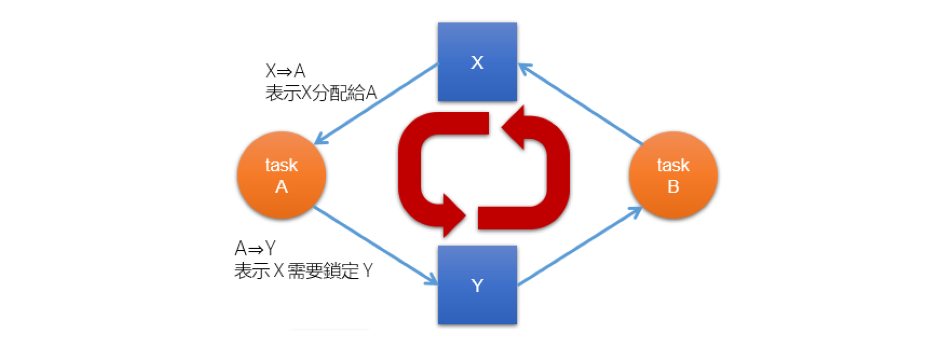

> Operating System: Design and Implementation course notes from CCU, lecturer Shiwu-Lo. 
{: .block-tip }

Liveness 指的是 Task 在執行期間必須滿足的一組屬性，以確保 Task 在執行週期中能不斷進行下去，這裡舉了三種例子導致 Liveness failure 的情況:
Deadlock, Livelock, Priority inversion，並且會在之後介紹一些預防 Deadlock 的方式。

-   What is deadlock?
-   How to prevent deadlock?
-   What is livelock?
-   What is priority inversion?
-   Priority inheritance protocol, priority ceiling protocol

### Deadlock

##### 6.1 What is deadlock?

-   Deadlock 就是指一群 task 互相等待對方釋放資源，造成所有 task 都無法繼續執行的狀況，例如:
```
    TaskA       TaskB
1.              lock(y)
2.  lock(x)
3.              lock(x)
4.  lock(y)
```
-   在這種情況下 A 等 B 的 unlock(y)，B 等 A 的 unlock(x)，造成 A 跟 B 都無法繼續執行
    -   要注意並不是每次都會發生 deadlock，只有在上面這樣交錯 lock 的情況才會發生 deadlock



-   簡單判別 Dealock 的方式是如上圖，假如一個圖中出現 Cycle，那麼就代表有可能會發生 deadlock。
    -   一種解決方式是索取資源時都按照順序，兩個 Task 都必須先去 lock(x) -> lock(y)，這樣就不會發生 deadlock

##### 6.2 How to prevent deadlock?

要發生 deadlock 必須滿足以下四個條件:
1.  Mutual exclusion: 資源不能被同時使用
2.  Hold and wait or resource holding: Task 持有一個資源並且等待另一個資源
3.  No preemption: OS 無法把分配出去的資源重新分配
4.  Circular wait: Resuource allocation graph 中至少有一個 cycle

> 注意要發生 deadlock 必須滿足以上四個條件，所以只要破壞其中一個條件就可以避免 deadlock 的發生

**Prevention mutual exclusion**

-   Mutual exclusion 是 Critical section 的主要功能
    -   通常也是 Resource 的本身特性，例如: 印表機不可能讓兩個 Task 同時使用
-   在一些情況下可以改寫演算法，讓 Resource 可以 Lock-free，例如: Lock-free concurrent queue
    -   或者讓每個 Task 都有自己的 Resource，不需要共用

> ##### Last Edit
> 12-08-2023 16:03
{: .block-warning }