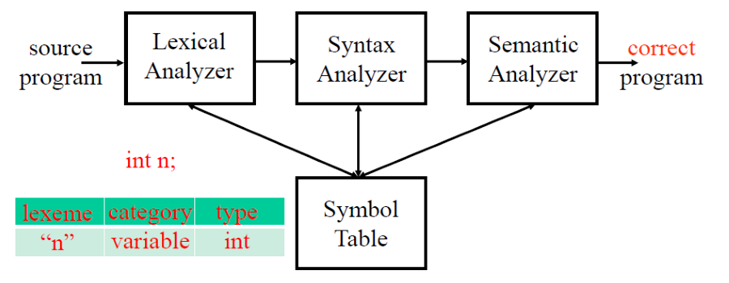
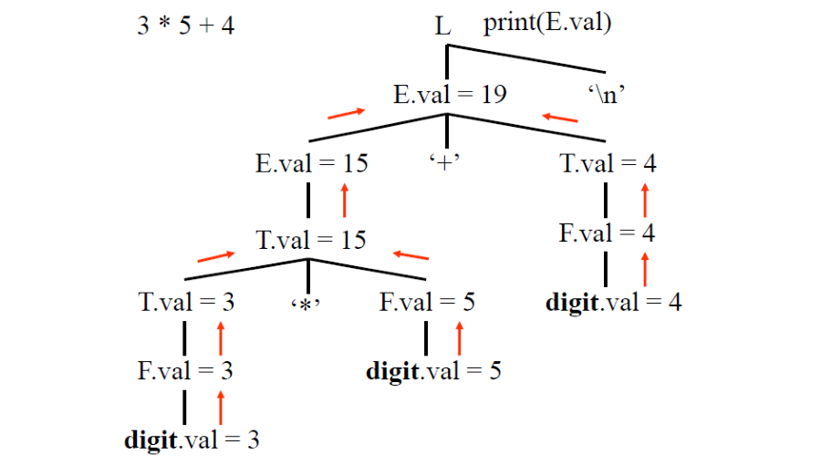
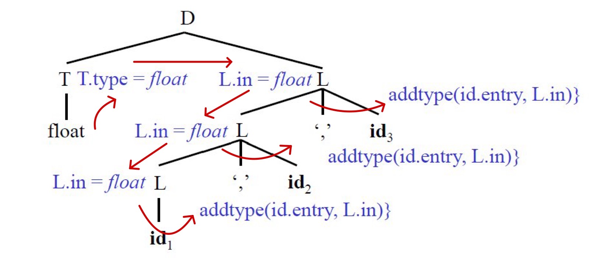

**Outline**
-   Semantic Analyzer
-   Attribute Grammars
-   Syntax Directed Translation
-   Type Checking
-   Syntax Tree Construction
-   Bottom Up Translators
-   Bison A Bottom Up Translator Generator

##### Semantic Analyzer

狹義上的 Semantic Analyzer(語意分析)只負責 Type checking，
但廣義上的語意分析則可以同時在 Type checking 時進行程式碼的 Interpretation 或 Translation。

-   Type checking of each construct
-   Interpreation of each construct
-   Translation of each construct

{:height="75%" width="75%"}

### 5.1 Attribute Grammars

Attribute Grammar(屬性語法) 也可以稱為 **Syntax Directed Definition**(SDD, 語法導向定義):
-   Attribute Grammars 是帶有 Associated semantic attributes(關聯語意屬性)與 Semantic rules(語意規則)的 Context-free grammar
-   每個 Grammar symbol 都關聯一組 **Semantic attributes**
-   每個 Production 與關聯一組計算屬性的 **Semantic rules**

**Example 5.1 An Attribute Grammar**

```
L -> E '\n'     {print(E.val)}
E -> E '+' T    {E.val = E.val + T.val}
E -> T          {E.val = T.val}
T -> T '*' F    {T.val = T.val * F.val}
T -> F          {T.val = F.val}
F -> '(' E ')'  {F.val = E.val}
F -> digit      {F.val = digit.val}
# val represents the value of an expression
```

例如 `E -> E '+' T`，他的 Semantic rules 為 `E.val = E.val + T.val`，其中 `E.val` 與 `T.val` 為 Semantic attributes。

{:height="75%" width="75%"}

> 把 3 * 5 + 4 當作範例化成 Syntax Tree 將會如上圖所示

-   **Synthesized attributes**(合成屬性):  
如果一個 Node(Grammar symbol) 在解析樹中的屬性值是由其子節點的屬性值計算出來的，則稱該屬性為合成屬性
-   **Inherited attributes**(繼承屬性):
如果一個 Node(Grammar symbol) 在解析樹中的屬性值是由其父節點的屬性值計算出來的，則稱該屬性為繼承屬性

> 5.1 的例子中可以看出全部都是 Synthesized attributes，下面是 Inherited attributes 的例子

```
D -> T { L.in := T.type } L
L -> int { L.type := integer }
L -> float { L.type := float }
L -> { L1.in := L.in} L1 ',' id { addtype(id.entry, L1.in) }
L -> { addtype(id.entry, L.in) }
```

{:height="75%" width="75%"}

**S-Attributed Attribute Grammar**  
-   如果一個 Attribute Grammar 的每個 Attribute 都是 Synthesized attributes，則稱為 S-Attributed Attribute Grammar

**L-Attributed Attribute Grammar**

-   An attribute grammar is L attributed if each attribute in each semantic rule for each production  
    A -> X<sub>1</sub> X<sub>2</sub> … X<sub>n</sub>
is a synthesized attribute, or an inherited attribute of X<sub>j</sub> , 1 <= j <= n, depending only on
    1. the attributes of X<sub>1</sub> , X<sub>2</sub> , …, X<sub>j-1</sub> 
    2. the inherited attributes of A

> 簡單來說就是如果一個 attribute 所使用的**「資訊來自上層或左邊」**，則稱為 L-Attributed Attribute Grammar

> ##### Last Edit
> 11-29-2023 18:10 
{: .block-warning }