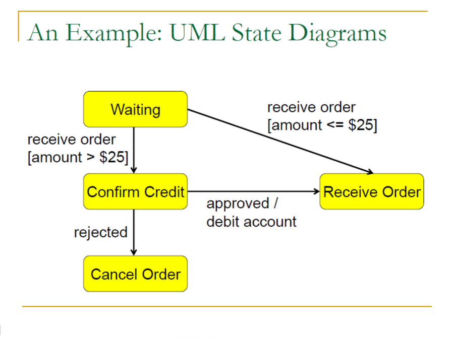
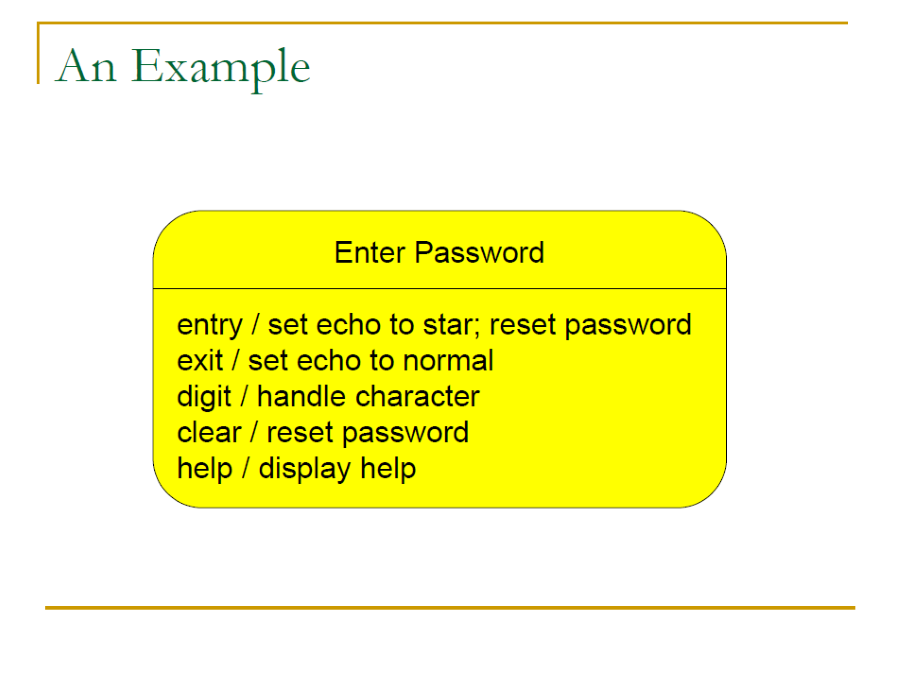
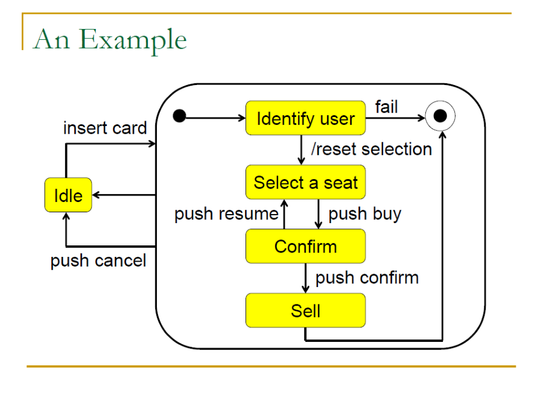
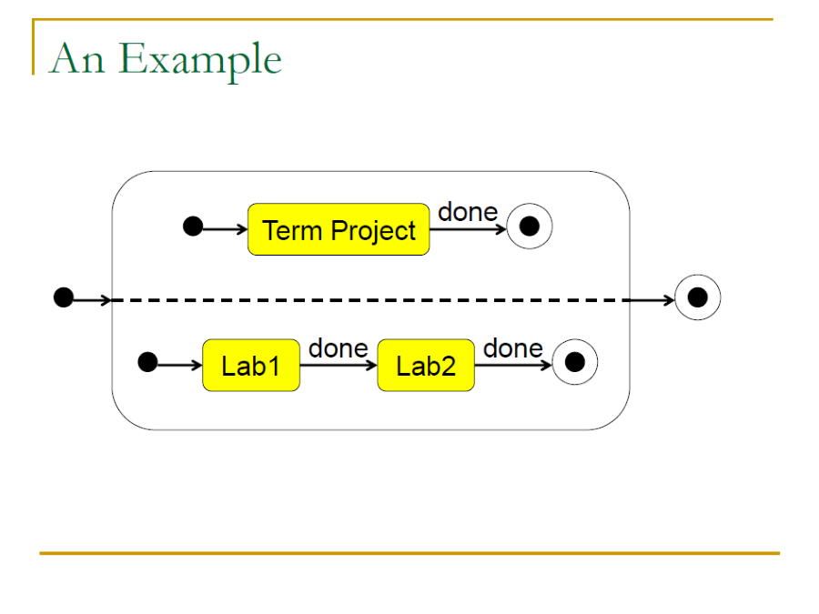
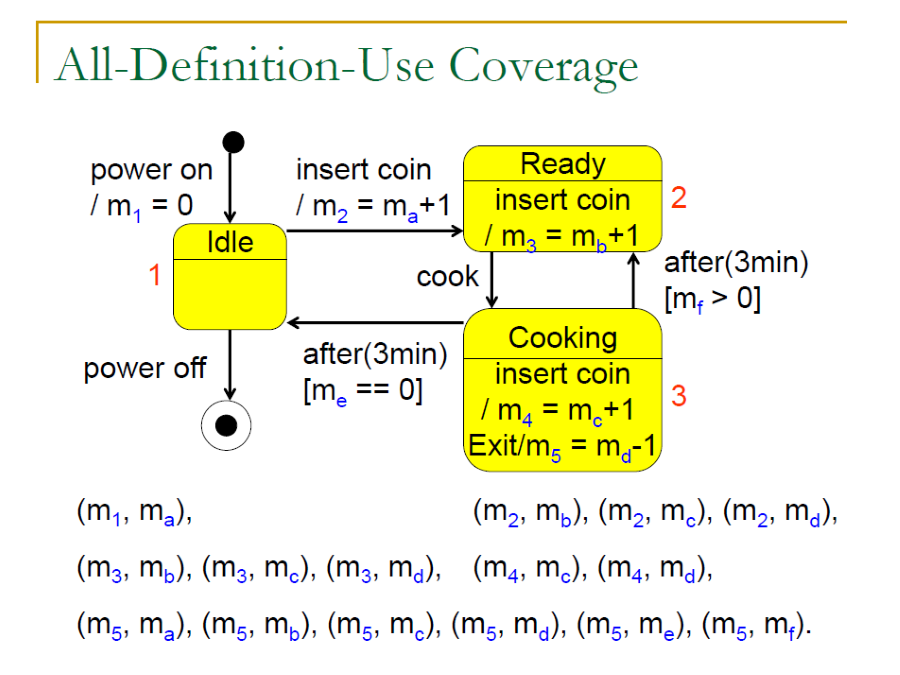
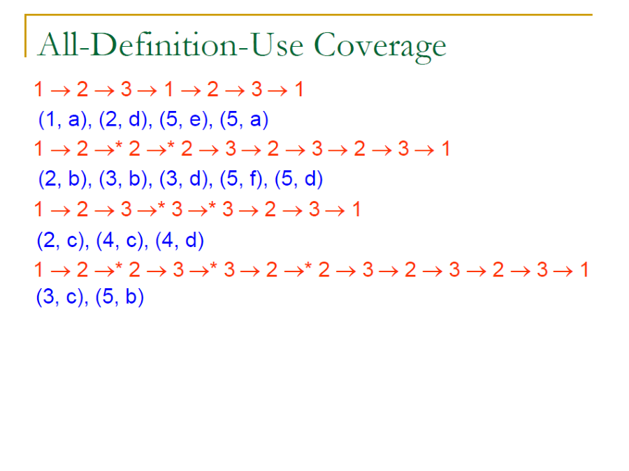
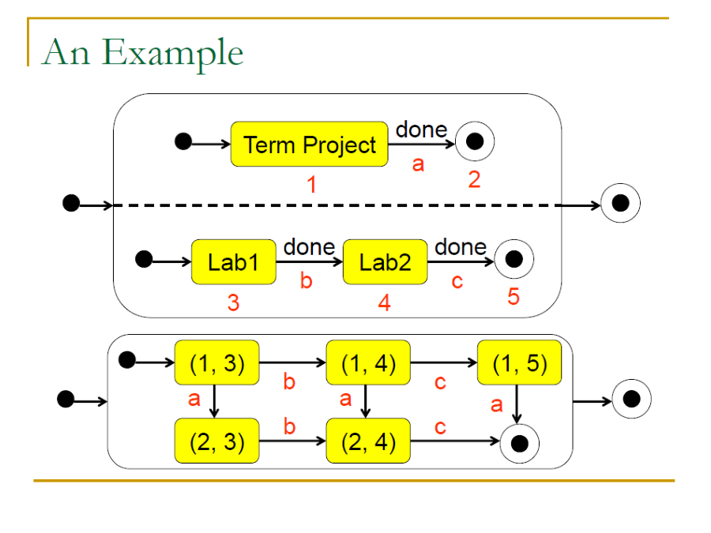
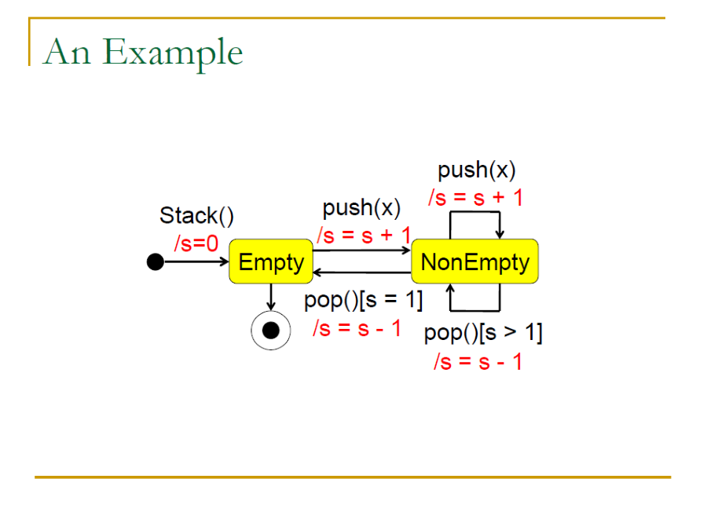
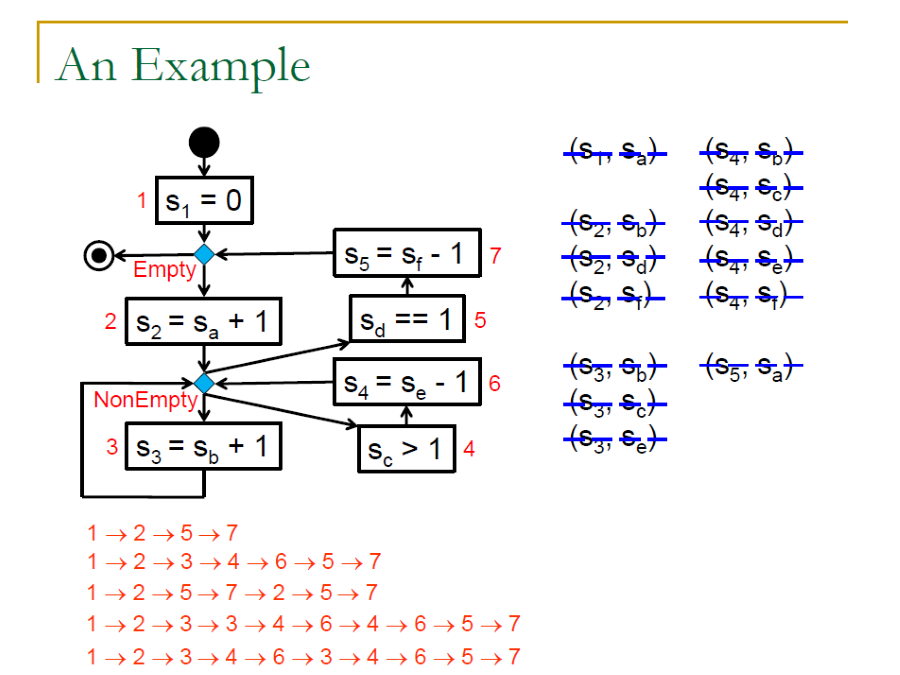

> Software testing course notes from CCU, lecturer Nai-Wei Lin.  
> 這章節主要開始介紹從 Class 層級的 Unit testing。
{: .block-tip }

Class level 開始不再把 Method 看作單一的個體，而是以狀態的角度來查看一個 Class 在不同狀態下是否能符合規格。

### 6.1 UML State Machine Diagram

-   Finite State Machines(FSM, 有限狀態機)用來描述 Object 隨時間變化的動態行為模型
-   FSM 視為對 Object 的一種局部視圖
-   每個 Object 都作為一個獨立的實體，透過 Event 與 Action 來做出反應與外部通訊

> 這裡可以參照 UML 中的 [State diagram], [UML 2 Tutorial - State Machine Diagram]

{:height="75%" width="75%"}

##### 6.1.1 Events

-   事件代表 Object 可以偵測到的改變，例如:
    -   一個 Object 對另一個 Object 的呼叫或 Single
    -   特定的 Variable 的變化或時間的流逝
-   任何可以影響一個物件的事物都可以被視為 Event
-   Event 發生在某一時刻，他並不具有持續性

**Event Type**

-   Call event:
    -   一個 Object 接受明確的同步呼叫請求，op(a : T)
-   Change event:
    -   Boolean expression 的值發生變化，when(exp)
-   Single event:
    -   Object 收到一個明確，並被命名的異步通訊(Async)，sname(a : T)
-   Time event:
    -   絕對時間或相對時間的流逝，after(time)

以之前的例子來說，receive order, rejected, approved 都是 Event

##### 6.1.2 State

Finit state machine 定義了數個 State，一個 State 可以用三種互補的方式來描述:
1.  一組性質相似的 Object values
2.  Object 等待某個事件或多個事件發生的時間段
3.  Object 執行某個持續進行的活動得時間段

##### 6.1.3 Transitions

-   離開一個 State 的轉換定義了 Object 在該 State 中對於 Event 發生的回應
-   通常情況下一個轉換 `e(a : T)[guard]/activity` 包含:
    -   **Event trigger(事件觸發器):** `e(a : T)` 
    -   **Guard condition(守衛條件):** `[guard]` 
    -   **Effect(效果):** `activity` 
    -   **Target state(目標狀態)**

**Event Triggers**
-   Event triggers(事件觸發器)指定了能夠觸發轉換的事件
-   如果該 Event 包含參數，這些參數在轉換的過程中可能會產生某些效果

**Guard condition**
-   一個轉換可能有 Guard condition(守衛條件)，這是一個 Boolean expression
-   他可能引用被轉換的 Object 的 attributes, parameters
-   當觸發事件發生時就評估 Guard condition
    -   如果為 true 則轉換發生; false 則不發生
-   同個事件可以觸發單一 State 中的多個轉換
    -   但是使用相同事件的轉換之間必須有不同的 Guard condition
    -   而一個 Guard condition set 將涵蓋所有可能性，確保 event 會觸發某個轉換
-   一個事件中只有一個轉換可能被觸發

**Effects**
-   當一個轉換觸發時，他的 Effects(效果)將被執行
-   效果可以是一個 Action 或 Activity
    -   Action: 可以是一個基本的計算，例如: 
        -   assignment statement
        -   simple arithmetic computation
        -   sending a signal
        -   calling an operation
        -   createing/destorying an object
        -   getter/setter
    -   Activity: 一連串的 Actions

**Change of State**
-   當一個 Effect 執行完畢，則 State 就將改變到 Target state

##### 6.1.4 Activites in State

一個 State 中也可以包含一系列的 Activity:

-   Entry activity: that is executed when a state is entered –entry/activity.
-   Exit activity: that is executed when a state is exited –exit/activity.
-   Internal activity: that is executed after the entry activity and before the exit activity –e(a:T)[guard]/activity.

{:height="75%" width="75%"}

##### 6.4 State Type

FSM 中的 State 可以分為以下幾類
-   **Initial state/Final state:** 一個 Psudo state(偽狀態)，用來表示 State machine 的開始與結束
-   **Terminate:** 表示 State machine 的銷毀或結束，包含釋放部分資源，清除狀態等
-   **Simple State:** 沒有子結構的 State
-   **Nonorthogonal State:** 包含一個或多個子狀態的複合狀態，狀態活動時代表其中至少有一個子狀態處於活動狀態
-   **Orthogonalstate**: 包含兩個或更多子狀態的複合狀態，狀態活動時代表其中所有子狀態都處於活動狀態

    
    

> 上圖左邊是 Nonorthogonal state，右邊是 Orthogonal state

### 6.2 Test Coverage Criteria

-   Control flow
    -   All-state coverage: 所有的 State 都被執行到的路徑
    -   All-transition coverage: 所有的 Transition(邊界)都被執行到的路徑
-   **Data flow**
    -   All-definition coverage: 所有的 Definition 都被執行到的路徑
    -   All-use coverage: 所有的 Use 都被執行到的路徑
    -   **All-definition-use coverage:** 所有的 Definition 與 Use 都被執行到的路徑
-   Both
    -   All-path coverage: 所有的路徑都被執行到，但如果有無限迴圈的話就無法完成

關於測試覆蓋標準的詳細說明可以參考 [Test Coverage Criteria] 這裡主要以 All-definition-use coverage 來說明

##### 6.2.1 Testing Paths

**Definition-Use Pairs**
-   The value of a definition of a variable may be used by several different uses of the variable.
-   A use of a variable may use the value defined by several different definitions of the variable.
-   Each definition and each of its uses compose a definition-use pair.
-   The set of definition-use pairs includes all the data flow relations.

    
    

**All-definition-use coverage 的測試流程如下:**
1.  找出所有的 Associations:
    -   每個 Definition 與 Use 之間都會有一個 Association
2.  使用圖形演算法找出路徑，這裡假設為 BFS
3.  找到一條路徑後就標記該條路徑覆蓋到的 Association
4.  直到所有的 Association 都被標記為止
    -   不是所有 Association 都是可行的，這裡可以使用手動判斷或是使用演算法來判斷

> 這裡所說的都是 Nonorthogonal state

##### 6.2.1 Orthogonal States

因為 Orthogonal State 中的 concurrency(並行)特性會使得測試變得複雜，所以需要將 Orthogonal State 轉換成 Nonorthogonal State 來進行測試。

-   如果一條路徑包含了 Orthogonal State 可以**將 State 中的每個完整子路徑都視為一條路徑來擴展成一組完整路徑集合**
-   因為 Orthogonal State 中的 **Concurrency** 特性，我們需要**將 Orthogonal State 轉換成 Nonorthogonal State**

**Orthogonal States to Nonorthogonal States**

-   假設有一個 Orthogonal State 有 n 個區域，並且 ni 中有 mi 個狀態
-   每個新狀態都是一個 n-tuple( x1, ..., xi, xn ), xi 是第 i 個區域中的舊狀態
-   如果在第 i 個區域中存在從 xi1 到 xi2 的轉換，那就存在一個 ( x1, ..., xi1, xn ) 到
( x1, ..., xi2, xn ) 的轉換

{:height="75%" width="75%"}

> 上圖將 Orthogonal State 中的所有狀態可能同時發生的情況都列出來然後組成一個新的 Nonorthogonal State

### 6.3 Constriant Logic Graph

如果直接從 State Diagram 來進行走訪與測試的話會需要很多而外的處理，所以更簡單的方式是將 State Diagram 轉換成 Constriant Logic Graph 來進行走訪。

    
    

> 假如有一個 stack 的 State machine 如圖左，將其轉換為右圖的 CLG 後會更好的找出 Associations 與路徑

> ##### Last Edit
> 12-12-2023 17:37 
{: .block-warning }

[State diagram]: ./2023-07-28-UML_behavior_diagrams.html#13-state-diagram
[UML 2 Tutorial - State Machine Diagram]: https://sparxsystems.com/resources/tutorials/uml2/state-diagram.html

[Test Coverage Criteria]: ./2023-11-28-test_coverage_criteria.html