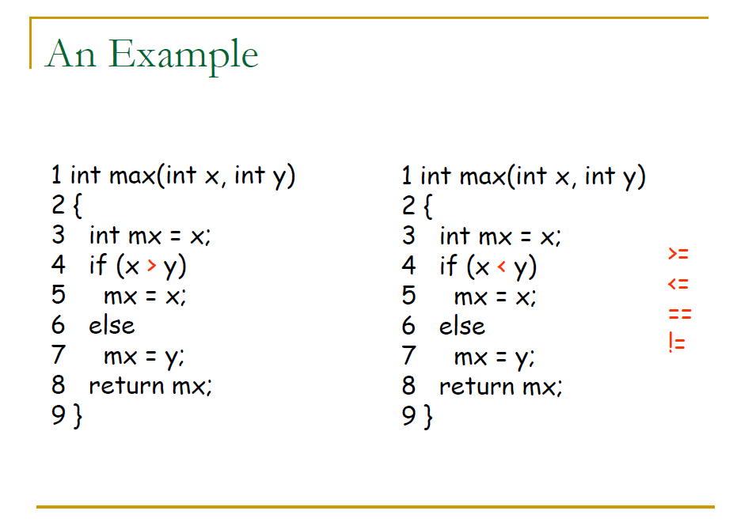
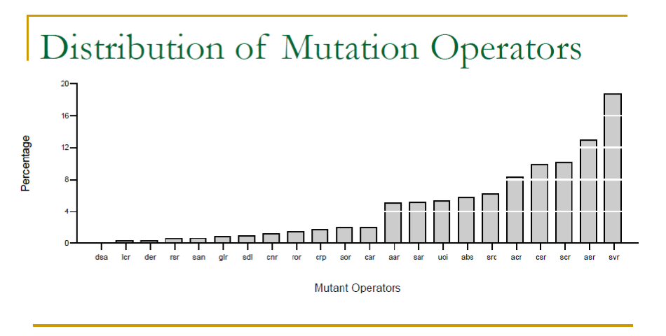
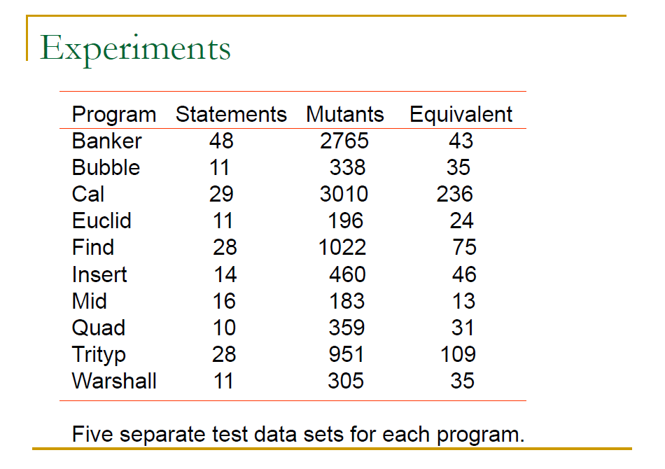
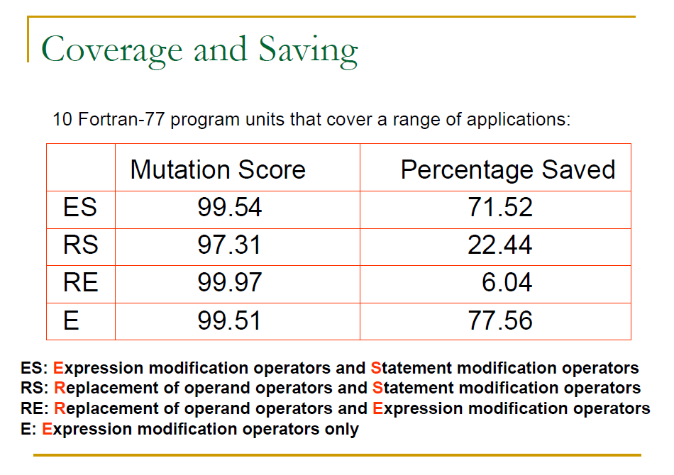

> Software testing course notes from CCU, lecturer Nai-Wei Lin.  
> 前面講的部分都是如何去產生測試案例，這裡會介紹 Mutation Testing，這是一種可以評估測試案例的方法
{: .block-tip }

### Mutation Testing

##### 7.1 What is Mutation Testing?

-   Mutation testing(突變測試)是一種基於錯誤的測試技術
-   如果一個測試能檢測出大部分簡單的錯誤，那麼這個程式就已經被充分的測試了

突變測試會去產生一組原程式的缺陷版本，這些缺陷版本被稱為突變體(mutant)，每個突變體都只包含一個簡單的錯誤，
通常是針對程式的一些運算子做修改，讓他與原程式不同造成錯誤。



> 上圖是一個突變的範例，把 `>` 改成 `<`, `>=`, `<=`, `==`, `!=` 這樣就產生了五個突變體

**Mutation Analysis Process**

突變分析的流程:

1.  首先以一組測試案例來測試原程式，這裡應該要確保原程式是能通過測試的
2.  同樣的一組測試案例來測試突變體
3.  如果一個突變體產生了與原程式不同的輸出，那麼這個突變體就被殺死了
4.  一個測試案例如果至少殺死了一個突變體，那麼這個測試案例就被認為是足夠有效的

**Equivalent Mutants**

Equivalent Mutants(等價突變體):

-   如果兩個程式在每個輸入上始終保持相同的輸出，那我們可以說這兩個程式在功能上是等價的
-   突變體也是一樣，如果突變體與原程式是等價的，那麼這個突變體就是等價突變體
    -   因為是等價的，所以突變體並不會被測試案例集殺死

以之前的例子為例，下面這個原始程式與突變體就是等價的，這邊要注意到即使輸入兩個相同的變數，原始程式返回 b，突變體返回 a，但這個程式在輸出上始終保持相同的輸出，所以這兩個程式是等價的。
```c
int max(int a, int b) {
    if (a > b) {
        return a;
    } else {
        return b;
    }
}

int max(int a, int b) {
    if (a >= b) {
        return a;
    } else {
        return b;
    }
}
```

##### 7.2 Mutation Score

-   Mutation Score(突變分數)，就是一組測試案例所可以殺死的非等價突變體的比例
    -   P: Program
    -   T: Test Case Set
    -   K: Number of killed mutants
    -   M: Number of mutants
    -   E: Number of equivalent mutants
-   以下是突變分數的公式，分數越高代表測試案例集越有效，可以殺死更多的突變體
\begin{flalign}
& \text{MS(P, T)} = \frac{\text{K}}{\text{M - E}} &
\end{flalign}

**Measuring Mutation Score of a Test Case Set**

如果一組測試案例集的突變分數為 100% 就代表是 Mutation adequate(突變充分的)，這組測試案例集可以殺死所有的非等價突變體。
但是在真實的開發中，要擁有一組突變分數到達 95% 以上的測試案例集是非常困難的。

##### 7.3 Mutation Operators

Mutation Operators(突變運算子)是對原程式做修改的規則:
-   突變運算子的集合取決於所使用的程式語言
-   Mothra 是一個用於 Fortran 77 程式的突變測試工具，他提供了 22 種突變運算子

> 延伸閱讀: [The Mothra tool set (software testing)]

這裡列出 Mothra 提供的突變運算子:

AAR: array reference for array reference replacement  
ABS: absolute value insertion  
ACR: array reference for constant replacement  
AOR: arithmetic operator replacement  
ASR: array reference for scalar variable replacement  
CAR: constant for array reference replacement  
CNR: comparable array name replacement  
CRP: constant replacement  
CSR constant for scalar variable replacement  
DER: DO statement end replacement  
DSA: DATA statement alternations  
GLR: GOTO label replacement  
LCR: logical connector replacement  
ROR: relational operator replacement  
RSR: RETURN statement replacement  
SAN: statement analysis  
SAR: scalar variable for array reference replacement  
SCR: scalar for constant replacement  
SDL: statement deletion  
SRC: source constant replacement  
SVR: scalar variable replacement  
UOI: unary operator insertion  

**Categories of Mutation Operators**

我們可以把突變運算子分成三種類別:
1.  Replacement of Operandoperators:
    -   把程式中的每個 Operand 都替換成其他的 Operand
    -   AAR, ACR, ASR, CAR, CNR, CSR, SAR, SCR, SRC, SVR
2.  Expression Modification Operators:
    -   把程式中的每個 Operator 都替換成其他的 Operator
    -   ABS, AOR, ROR, UOI
3.  Statement Modification Operators:
    -   把程式中的每個 Statement 都替換成其他的 Statement
    -   DER, DSA, GLR, LCR, SDL

### High Cost of Mutation Testing

-   突變測試的主要缺點是運行大量突變體對抗測試案例集的成本非常高
-   為一個程式產生的突變體數量與數據引用數和數據對象數的乘積成正比
-   即使是一個小程式，這個數字也是相當大的

**Reducing Cost of Mutation Testing**

這裡提出幾種可能減少突變測試成本的方法:
1.  Selective Mutation: 做更少的方法
2.  Weak Mutation: 做的更聰明的方法
3.  Schema-Based Mutation: 做的更快的方法

[MuJava] 是一個針對 Java 的突變測試系統，實現了這三種方法，同時在 Eclipse 上也有提供插件 [MuClipse]

##### 7.5 Selective Mutation

-   Selective Mutation(選擇性突變): 是指只針對一些特定的方法做突變，忽略那些會造成大量突變體的 Operator
-   N-Selective Mutation(N-選擇性突變): 忽略最常導致突變體產生的 N 個 Operator
    -   像是 Mothra 來說就省略了 SVR、ASR 兩種 Operator



> SVR、ASR 兩種 Operator 是會產生最多突變體的前兩名 Operator

**Compare Selective Mutation with Non-Selective Mutation**

假如我們使用了「一組測試案例」去針對 Selective Mutation 來達到 100% 的突變分數，如果這組測試案例在 Non-Selective Mutation(非選擇性突變)的突變分數也能表現良好，
那麼就能以此來證明 Selective Mutation 是有效的。

-   Non-Selective Mutation: 針對所有的 Operator 做突變

**Experiments**

來自 [An experimental determination of sufficient mutant operators] 的實驗結果，它們使用多個程式來進行突變，並在之後比較四種不同的突變方法:

<div style="display: flex; flex-direction: row; align-items: center;">
    
    
</div>

最終的結論是，實際上只要保留五個關鍵的 Mutation Operator 就能提供與 Mothra 中的 22 個 Operator 幾乎相同的覆蓋率，
並且成本在小型程式中減少了四倍，在大型程式中減少了五十倍。

-   這五個關鍵的 Operator 是: ABS, AOR, LCR, ROR, UOI

##### 7.6 Weak Mutation

Weak Mutation(弱突變) 是一種近似的突變測試方法，他在程式的突變位置執行後立刻去比較突變體與原程式的內部狀態，
已經有實驗證明，Weak Mutation 與 Strong Mutation(強突變) 一樣有效，並且成本降低至少 50%。

**Four Potential Points for State Comparison**

那我們需要考慮的就是在什麼時間點去比較突變體與原程式的內部狀態，這裡提出了四個可能的時間點:
1.  在突變符號的 Innermost Expression 進行第一次評估之後
2.  在突變 Statement 進行第一次評估之後
3.  在包含突變語句的 Basic Block 進行第一次評估之後
4.  在包含突變語句的 Basic Block 全部評估之後

```c
while() {
    if() {
        y = x + /* 1 */ 1; /* 2 */
    } /* 3 */else {
        ...
    }
    /* 4 */
}
```

**Schema-Based Mutation Analysis**

Schema-Based Mutation Analysis(基於模式的突變分析)是一種弱突變的方法
-   將所有突變體編碼到一個可以參數化的 Source-level program(源程式)中，稱為 Meta-Mutant(元突變體)
-   元突變體使用與編譯原始程式相同的編譯器進行編譯
-   元突變體具有運行時充當任何突變體的能力
-   這樣成本就能減少到一個數量級

**Metaoperators**

Metaoperators(元運算子)是一種用來產生元突變體的突變運算子，例如:
-   AOR metaoperator: 用來產生 AOR 元突變體
-   對於 Statement `Result = A - B`，可以產生四種突變體:
    -   `Result = A + B`
    -   `Result = A * B`
    -   `Result = A / B`
    -   `Result = A % B`
-   那麼這些突變體可以通用的表示為 `Result = A ArithOp B`，其中 ArithOp 是 Metaoperator

**Metaprocedures**

-   把上面的方法重寫為 Result = AOrr(A, B)，其中 AOrr 是 Metaprocedure
    -   在 AOrr 中會執行 `Result = A ArithOp B` 這五種可能的突變體
-   這樣就可以把所有的突變體都編碼到一個可以參數化的 Source-level program 中

**Class Level Mutation Operators in MuClipse**
-   Access control: AMC
-   Inheritance: IHD, IHI, IOD, IOP, IOR, ISK, IPC
-   Polymorphism: PNC, PMD, PPD, PRV
-   Overloading: OMR, OMD, OAO, OAN
-   Java-specific features: JTD, JSC, JID, JDC
-   Common-programming mistakes: EOA, EOC, EAM, EMM

這些是 MuClipse 所提供的 Class-level 突變運算子，這些突變運算子都是針對 Java 語言所設計的

##### 7.7 Equivalent Mutants

這裡做了一個實驗，對於 6 個程式一共 866 個 Class 進行不同層級的突變，來查看等價突變體的比例:
-   在 Method-level 突變測試中，Equivalents Mutants 的比例約為 5% ~ 15%
-   在 Class-level 突變測試中，Equivalents Mutants 的比例平均為 75%

> ##### Last Edit
> 1-2-2024 02:51 
{: .block-warning }

[The Mothra tool set (software testing)]: https://ieeexplore.ieee.org/document/48002

[MuJava]: https://cs.gmu.edu/~offutt/mujava/
[MuClipse]: https://muclipse.sourceforge.net/

[An experimental determination of sufficient mutant operators]: https://dl.acm.org/doi/10.1145/227607.227610