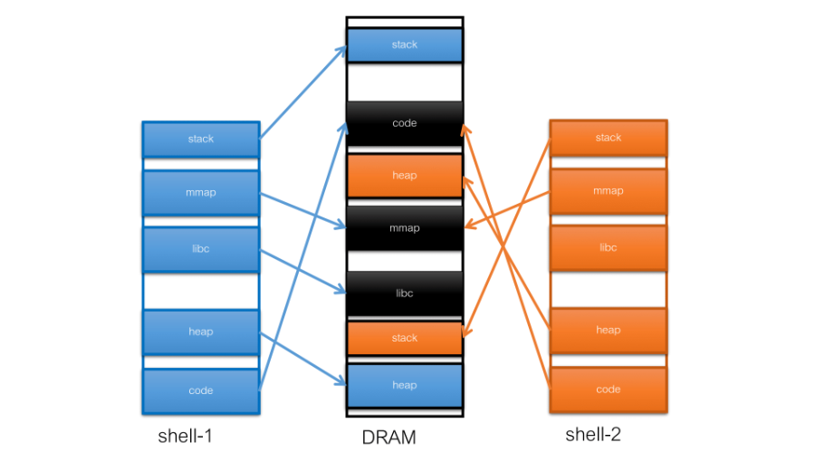
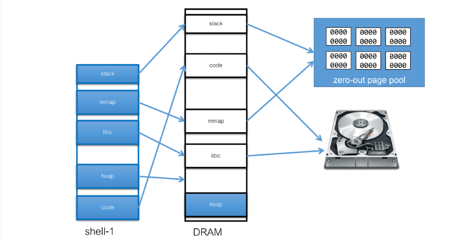

> Operating System: Design and Implementation course notes from CCU, lecturer Shiwu-Lo. 
{: .block-tip }

本章節會主要介紹 Virtual Memory 這是這章節的討論範圍

-   Virtual Memory Hardware and Software
-   Virtual Memory Example
-   Page Replacement
-   Working Set
-   open, read, writ vs. mmap
    -   這幾種 System Call 的差異
-   TLB miss

##### MMU Main Function

-   MMU 主要處理記憶體分配的問題
    -   消除了 External fragmentation(外部碎片)
    -   由於 Page size 僅有 4KB，所以 Internal fragmentation(內部碎片)很輕微
-   如果 TLB miss
    -   假設該 TLB 要去 Mapping 的 Page 在 Memory 中只要將 Virtual memory to Physical memory 的 Mapping 加入 TLB 即可
    -   上述的動作可以使用 Hardware 來完成，或使用 Software 來完成
-   如果 TLB miss 並且 Hardware 的表格也查不到呢
    -   稱之為 Page fault

### What is Virtual Memory

##### 8.1 Define the Virtual Memory

嚴格的定義: **由軟體重新定義 Page fault**
-   當 CPU 所要存取的 Memory 根本不存在於 DRAM 中時，就稱作為 Page fault
    -   如果我們啟動 Software 此時該 Software 所要存取的 Memory 根本不存在於 DRAM 中，就稱作為 Page fault，例如 Segmentation fault
-   OS 設計者重新詮釋了 Page fault 的意義，例如:
    -   OS 暫時還沒把該 Page 載入到 DRAM 中，重新載入就好
        -   例如: Execl 我可以不用一次把所有的功能都載入，等到使用者真的要使用到該功能時，再載入該功能就好
    -   OS 讓不同的 Process 隱形共用內容相同的 Page
        -   唯讀，不會有任何問題發生，還可以減少記憶體使用量，例如: fork() 使用 Copy-on-write 的技術來實作
        -   寫入，OS 必須確保每個 Process 在邏輯上都有自己的 Page，例如: 即使 fork() 使用同一份 Memory，但是要確保程式的 Logic address 上是不同的

稍微寬鬆一點的定義: **讓 Mapping 變得更加靈活**
-   透過設定 MMU，使 Memory Mapping 更加靈活的例子
    -   Shard Memory，讓不同的 Process 可以共用同一份 Memory
    -   可以將檔案 Mapping 到 Process 的 Memory Space，讓 Process 可以直接存取檔案
    -   可以將部分 I/O 的記憶體 Mapping 到 Process 的 Memory Space，讓 Process 可以直接控制 I/O
        -   Linux 中使用 mmap 存取 `/dev/mem`

##### 8.2 Virtual Memory Components

> 下圖是 Virtual Memory 中會需要的組件

{:height="100%" width="100%"}

-   Hardware table(Page table)
    -   這部分由 OS 來寫入硬體所設計的表格，由 MMU 來讀取，例如: x86 定義表格，Linux 依照 x86 的定義來實作
    -   每個 Process 都有自己的 Page table
    -   如果 TLB miss 硬體查詢 Page table 還是找不到，此時觸發 Page fault exception
-   Software table(mm_struct, kerne mapping table)
    -   每個 Process 甚至 Linux Kernel 都需要一個查詢表，快速的查詢每個 Memory 是否正確
    -   如果正確還發生 Page fault 如何處理？
-   處理 Page fault
    -   OS 必須有 Page fault handler(Interrupt service routine)
    -   並且要能紀錄: 錯誤的原因，錯誤的 Address

### Virtual Memory Example

##### 8.3 Shard Memory

{:height="75%" width="75%"}

-   stack, heap 這部分是程式自己獨有的
-   黑色的部分是共享的:
    -   code, libc: 這兩個是同一個程式但是開了兩個 Process
        -   因為在執行時會去 Mapping 硬碟上的執行檔，這樣 OS 就能知道其實這兩個 Process 完全是一樣的
        -   並且這部分只能 Read，這樣就沒有 Locked 所造成的效能瓶頸
    -   mmap: 這部分不是由 Kernel 去分享的，當 Shell 去呼叫 mmap syscall，後得到一個符號這樣就可以將該記憶體映射至自己的 Memory
        -   shell-1 將資料傳給 shell-2 要傳的是資料在 mmap 中的 offset
        -   盡量不要去指定 mmap 要被映射的 Address
-   Virtual Memory 允許 Code, Data 共享
    -   多個程式使用相同的 Library，例如: libc
    -   應用程式透過 Shared memory 共享資料，例如: mmap
    -   Parent 和 Child 都沒呼叫 execv 的話，記憶體內容幾乎一樣，例如: Copy-on-Write
-   Linux 允許隱含式的共享
    -   Linux kernel 可能會掃描 Memory，將內容一樣的 Page 隱含共享
    -   例如: 電腦的桌布跟登入畫面使用同一張圖片，記憶體內容是一樣的

##### 8.4 Demand Paging

**Define of Demand paging**

-   作業系統不會立刻將使用者所需要的 Memory 配置給 User
-   發生 Page fault 時，才會載入該段記憶體的資料

**Demand paging advantage**

因為只需要載入需要的資料
-   Less I/O needed
-   Less memory needed
-   Faster response
    -   啟動時間，只需要載入需要的資料就能啟動了
-   More users/programs
    -   因為每個程式需要的記憶體較少，因此可以載入更多的應用程式

**Demand paging shortcoming**

-   對於 Disk system，Demand paging 雖然減少了讀取的量，但是會引發大量的 Random access
    -   例如: 執行兩個程式，這兩個程式一共 100 MB，OS 可以驅動 Disk 使用兩秒鐘的時間來載入這兩個應用程式。
    -   如果使用 Pure demand paging，假設只要讀入 10 MB，2560 個 Pages，假如這兩個程式輪流執行，並且執行的程式碼**「隨機散布」**，
    目前 Disk 的 IOPS 約為 200，則載入兩個程式的時間變為 25.6 Sec
-   除了引發大量的 Random access 以外，Demand paging 也可能會造成執行期間有些 Lag
    -   例如: 不希望玩遊戲時會有延遲，就要一次把遊戲所要用的資料全部載入

{:height="75%" width="75%"}

> ##### Last Edit
> 12-19-2023 16:03
{: .block-warning }