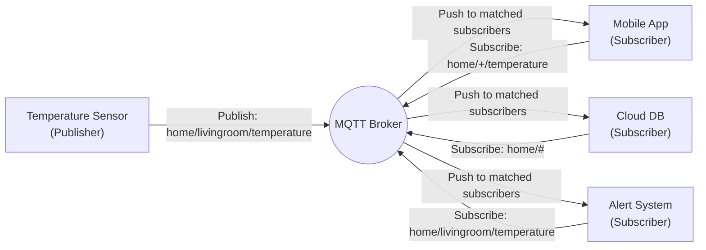

> MQTT (Message Queuing Telemetry Transport) 是一種輕量級的訊息傳輸協定，專為物聯網 (IoT) 設計。它基於發布/訂閱模式，適合在低帶寬、不穩定的網路環境下使用。
{:.block-tip}

> MQTT 的優勢在於惡劣環境下確保傳輸成功設計的輕量級協定，並且支援 QoS (Quality of Service) 等級，讓開發者根據需求決定「訊息到底要多可靠」。
> 尤其是在 IoT 裝置中，Header 最小可以只需要 2 bytes，與之相對的 HTTP 協定 Header 動輒就需要 200 bytes 以上，
對於資源有限的裝置來說，MQTT 是一個更好的選擇。

### 1. What is MQTT?

> MQTT 的全名是 **Message Queuing Telemetry Transport**，但請注意：它跟傳統的 Message Queue（如 RabbitMQ、Kafka）雖然名字都有 Queue，設計哲學卻完全不同。MQTT 並不會把訊息「排隊」在 Broker 上等你去領，而是透過發布/訂閱的模式主動把訊息推給你
{:.block-tip}

[MQTT] 誕生於 1999 年，由 IBM 的 Andy Stanford-Clark 與 Arlen Nipper（當時在 Eurotech）為了**監控橫跨荒野的石油管線**而設計。當時的場景是：透過昂貴、不穩定、頻寬極低的衛星連結，把分散在各處的感測器資料傳回控制中心。

這個背景很重要，因為它決定了 MQTT 的全部設計取向：

- **極小的封包開銷**：Header 最小只要 2 bytes，能在窄頻網路上跑。
- **能容忍網路斷斷續續**：連線不穩時不會直接崩潰。
- **為資源受限的裝置設計**：MCU 等嵌入式設備也能跑得動。

後來 MQTT 在 2013 年交由 [OASIS] 標準化（目前主流為 3.1.1 與 5.0 版本），也因為實在太適合物聯網，逐漸成為 IoT 領域的事實標準（de facto standard）。

> 簡單一句話：**MQTT 是為「網路很差、裝置很弱、電量很少」的場景而生的輕量級通訊協定**，而這恰好就是絕大多數 IoT 應用的真實處境
{:.block-warning}

---

### 2. The Publish/Subscribe Model

> MQTT 的核心精神是 **Decouple（解耦）**：發送訊息的人不需要知道誰在接收，接收訊息的人也不需要知道誰在發送。雙方唯一的交集，就是「主題（Topic）」
{:.block-tip}

傳統的 Request/Response（如 HTTP）是點對點的：A 直接呼叫 B。但 IoT 場景裡，一個溫度感測器可能要同時通知手機 App、雲端資料庫、與告警系統，若讓裝置自己維護這些連線，很快就會吃不消。

MQTT 引入了一個中間人——**Broker**，把所有裝置都變成「只跟 Broker 講話」。這就是經典的 **Publish/Subscribe（發布/訂閱）** 模式：



#### 2.1 三大核心概念

**Broker（代理人 / 中介伺服器）**
: 整個系統的核心，負責接收所有發布的訊息，並依據 Topic 轉發給有訂閱的客戶端。常見的開源實作有 [Mosquitto]、[EMQX]（後面第六章會再提到）。

**Topic（主題）**
: 用 `/` 分隔的階層式路徑字串，用來標示「這則訊息是關於什麼的」。例如：

  ```
  home/livingroom/temperature
  ```

  這條路徑可讀作「家 / 客廳 / 溫度」。訂閱時可以使用萬用字元：
  - `+`：單層萬用字元，例如 `home/+/temperature` 可匹配客廳、臥室、廚房的溫度。
  - `#`：多層萬用字元，例如 `home/#` 可匹配 home 底下所有子主題。

**Payload（酬載 / 訊息內容）**
: 真正要傳遞的資料本體。MQTT 對 Payload 的格式**完全不關心**，它可以是 JSON、純文字、甚至是二進位資料。例如：

  ```json
  { "value": 26.5, "unit": "C", "ts": 1788920000 }
  ```

> 這裡有個常被忽略的重點：**Topic 只是「地址」而不是「資料」**。資料全部都放在 Payload 裡，Broker 只負責根據地址轉信，不會去解析你的內容
{:.block-warning}

---

### 3. Key Features

> 如果只能記三個 MQTT 的王牌特色，那就是 **QoS（可靠性）**、**Retained Messages（新訂閱者立刻有資料）**、以及 **LWT（設備掛掉會通知大家）**。這三個機制加起來，才讓 MQTT 在不可靠網路下依然「可靠」
{:.block-tip}

#### 3.1 QoS（Quality of Service，服務品質）

QoS 決定了一則訊息「到底要被保證送到什麼程度」。MQTT 提供三個等級：

| QoS Level | 名稱 | 保證程度 | 封包來回 | 適用場景 |
| :---: | :--- | :--- | :---: | :--- |
| **0** | At most once（最多一次） | 盡力送達，可能丟失 | 0 | 高頻感測資料（如每秒溫度），偶爾漏一筆無所謂 |
| **1** | At least once（至少一次） | 保證送達，但可能重複 | 1 | 一般狀態更新，接收端要能容忍重複 |
| **2** | Exactly once（恰好一次） | 保證送達且不重複 | 4 | 計費、控制指令等不容出錯的關鍵操作 |

> QoS 2 最可靠但也最慢（需要四次握手），所以**不是等級越高越好**。實務上絕大多數遙測資料用 QoS 0 或 1 就夠了，只有真正不能出錯的控制指令才會考慮 QoS 2
{:.block-warning}

#### 3.2 Retained Messages（保留訊息）

一般情況下，如果你在「還沒人訂閱」的時候發布訊息，那則訊息就直接消失。但 **Retained Message** 會讓 Broker 把這則訊息「釘」在該 Topic 上：之後任何新訂閱者一連上來，立刻就能收到最新狀態，不需要乾等下一筆資料。

這在 IoT 裡非常實用，例如 `home/livingroom/light` 的開關狀態設為 Retained，新的 App 一連線就知道燈現在是開還是關，不用等感測器主動再報一次。

#### 3.3 Last Will and Testament（LWT，遺言機制）

> LWT 是 MQTT 的「遺書」：裝置在連線時先預先留一句話在 Broker，如果它**不正常斷線**（沒好好說再見），Broker 就會自動把這句話發布出去，通知其他人「這台裝置掛了」
{:.block-tip}

正常斷線（發送 `DISCONNECT`）不會觸發 LWT。只有當連線意外中斷（網路掉、電力耗盡、程式崩潰）時，Broker 才會替它把遺言發出來。例如一台感測器連線時設定：

```
Will Topic:   home/livingroom/sensor/status
Will Payload: offline
```

那麼當它突然斷線，所有訂閱該主題的系統就會立刻收到 `offline`，可以馬上觸發告警或把設備標記為離線——這正是傳統輪詢架構很難優雅做到的事。

---

### 4. MQTT vs. HTTP

> 結論先行：**物聯網不用 HTTP 當主力協定，不是因為 HTTP 不好，而是因為它的設計假設（穩定網路、充足電力、雙方可直連）在 IoT 場景裡根本不成立**
{:.block-tip}

| 比較項目 | MQTT | HTTP |
| :--- | :--- | :--- |
| **通訊模式** | 發布/訂閱（Push，Broker 主動推） | 請求/回應（Pull，客戶端輪詢） |
| **連線機制** | 長連線（TCP 一直保持） | 短連線（每次請求建立/斷開） |
| **Header 開銷** | 極小，最小 2 bytes | 較大，動輒 200+ bytes |
| **耗電量** | 低（連線常駐，不用頻繁握手） | 高（每次都要 TCP + TLS 握手） |
| **即時性** | 高，事件發生即刻推送 | 低，依賴輪詢間隔 |
| **雙向傳輸** | 原生支援（Server → Client 也行） | 主要靠客戶端輪詢才能拿到更新 |
| **適合對象** | 嵌入式裝置、電池供電設備 | 瀏覽器、REST API、一般伺服器 |

最關鍵的差異在於**長連線 vs. 短連線**：HTTP 每次請求都要重新握手（尤其加上 TLS 後更耗電），對用電池的感測器是致命傷；而 MQTT 連上後就一直保持 TCP 連線，Broker 有訊息立刻推過來，裝置大部分時間可以休眠，只在收到推送時醒來處理。

> 當然，這不代表 MQTT 要取代 HTTP。實務上常見的做法是：**裝置端用 MQTT 跟 Broker 溝通，再由 Broker 背後的橋接層把資料轉成 HTTP/REST 給後端系統或 Dashboard 使用**，兩者各司其職
{:.block-warning}

---

### 5. Quick Start

> 學任何協定最快的方式就是動手連一次。下面用 Python + [paho-mqtt] 連上公開測試 Broker `broker.hivemq.com`，同時做到「訂閱」與「發布」，跑完你就懂 MQTT 的運作邏輯了
{:.block-tip}

先安裝套件：

```bash
pip install paho-mqtt
```

以下是一個最小可運行的範例：它會訂閱 `home/livingroom/temperature`，並在連線成功後發布一筆溫度資料，隨後印出收到的訊息。

```python
import paho.mqtt.client as mqtt

BROKER = "broker.hivemq.com"   # 公開測試 Broker，不用帳號密碼
PORT = 1883                     # MQTT 預設連接埠（1883 = 未加密, 8883 = TLS）
TOPIC = "home/livingroom/temperature"

# 當成功連上 Broker 時會被呼叫
def on_connect(client, userdata, flags, rc, properties=None):
    print(f"Connected with result code {rc}")
    client.subscribe(TOPIC)              # 訂閱主題，預設 QoS 0
    # 連線後立即發布一筆訊息（Payload 用 JSON 字串）
    client.publish(TOPIC, '{"value": 26.5, "unit": "C"}', qos=1)

# 當收到訂閱主題的訊息時會被呼叫
def on_message(client, userdata, msg):
    print(f"[{msg.topic}] {msg.payload.decode()}")

client = mqtt.Client(mqtt.CallbackAPIVersion.VERSION2)
client.on_connect = on_connect
client.on_message = on_message

client.connect(BROKER, PORT, keepalive=60)
client.loop_forever()   # 進入事件迴圈，持續監聽並處理網路流量
```

跑起來後你會看到：程式先 `Connected`，接著因為自己發、自己也訂閱了同一個 Topic，所以會馬上從 `on_message` 收到自己剛才發的那筆 `{"value": 26.5, "unit": "C"}`。

> 小技巧：開兩個終端機各跑一份，A 發 B 收、B 發 A 收，你就能親眼看到 Broker 是如何把訊息從一個發布者轉發給另一個訂閱者——這正是第二章講的 Decouple 在真實運作
{:.block-warning}

---

### 6. Conclusion & Next Steps

> MQTT 之所以能成為 IoT 標準，本質上就是做對了一件事：**用最少的資源，在不可靠的網路上把訊息可靠地送達**。發布/訂閱解耦了裝置、QoS 解決了可靠性、Retained 與 LWT 解決了狀態與離線感知
{:.block-tip}

回顧一下這篇文章的重點：

- **架構上**：Broker 居中協調，裝置之間完全解耦，只靠 Topic 地址溝通。
- **可靠性上**：QoS 0/1/2 讓你按需求取捨速度與保證；Retained 與 LWT 補齊了「新訂閱者」與「異常離線」兩個常見痛點。
- **對比上**：相較 HTTP 的短連線輪詢，MQTT 的長連線 + 主動推送在耗電與即時性上全面勝出。

**下一步可以往這些方向深入：**

- **安全性（TLS/SSL）**：本文用的是 `1883` 明文連線，正式環境請改用 `8883`（MQTT over TLS），並搭配帳號密碼或 Client Certificate 做身份驗證。
- **認證與權限**：研究 Broker 的 ACL（Access Control List），限制每個裝置只能讀寫自己被允許的 Topic。
- **開源 Broker 推薦**：
  - [Mosquitto]：輕量、易上手，適合單機或嵌入式閘道器。
  - [EMQX]：分散式、高併發，適合大規模雲端部署，支援 MQTT 5.0 與多種橋接。
- **協定版本**：有空可以研究 [MQTT 5.0] 新增的 Reason Code、User Properties、Shared Subscription 等進階特性。

[MQTT]: https://mqtt.org/
[OASIS]: https://www.oasis-open.org/
[Mosquitto]: https://mosquitto.org/
[EMQX]: https://www.emqx.io/
[paho-mqtt]: https://www.eclipse.org/paho/
[MQTT 5.0]: https://docs.oasis-open.org/mqtt/mqtt/v5.0/mqtt-v5.0.html

> ##### 延伸閱讀
> [SSO Introduction](./2026-06-09-SSO_introduction.html)
{: .block-tip }

> ##### Last Edit
> 07-08-2026 22:15
{: .block-warning }