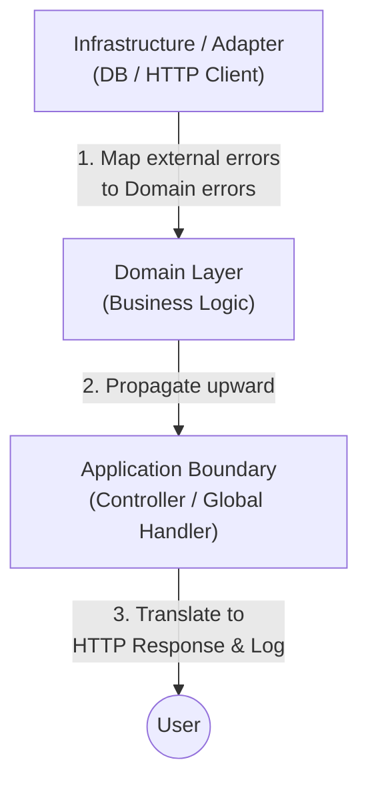

> 在設計例外處理機制時，我們應該將其劃分為兩個獨立的維度：**Exception Message**（拋出時附加的 context）與 **try-catch**（攔截異常的 interception point）。
> 一個好的 Exception Message 告訴你 *what* failed；而一個好的 catch 則告訴你 *why* you're allowed to handle it。
{:.block-tip}

> 這篇文章主要探討何時應該為例外加入訊息，以及何時與何地應該撰寫 try-catch 區塊。文章內容會使用 Java 程式碼作為範例，
> 但核心概念在大多數語言中都是通用的。
{:.block-warning}

### 1. Overview

> 這兩個維度在設計上是正交（orthogonal）的：Message（at throw time）× Catch（at handle time）。拋出例外的當下與處理例外的階段應該分開思考。
{:.block-tip}

在實際開發中，我們常常看到將這兩者混為一談的糟糕設計。

> 最常見的錯誤就是隨意拋出 `throw new Exception("error")`，然後在不知情的外層盲目地 `catch (Exception e)`。這樣不僅讓系統丟失了真正的錯誤細節，還可能掩蓋了致命的問題。
{:.block-danger}

為了更好地理解，我們可以根據系統的內部邏輯（Internal）與邊界（Boundary），來判斷是否需要附加訊息與是否需要捕捉。簡單一句話：你需要根據當下所處的位置來決定例外的處理策略。以下是一個 2×2 的預覽表格：

| Scope | Needs Message? | Needs Catch? |
| :--- | :--- | :--- |
| **Internal** | **Sometimes.** 取決於 Exception Type 的命名是否已經足夠明確。 | **No.** 除非你能就地修復它，否則應該讓它往上拋。 |
| **Boundary** | **Yes.** 必須包含足夠的 context 讓呼叫端能理解並回應。 | **Yes.** 必須捕捉所有例外，並轉換為標準的回應格式。 |

---

### 2. When to Add an Exception Message

> **核心原則**：Exception Message 的目標不是「記錄錯誤」，而是「提供上下文」。好的 Message 應該要讓維護者在看到 Log 的當下，就能準確判斷發生了什麼，而不需要重新執行或 Debug。
{:.block-tip}

#### 2.1 什麼是好的 Message — 3W 原則

要寫出有意義的 Message，建議遵循 3W 原則：

-   **What**: 發生了什麼具體錯誤？
-   **Where**: 發生在哪個特定的 Context 下？
-   **Why**: 為什麼這會導致問題？（如果不是顯而易見的話）
-   **Actionable info**: 提供導致錯誤的 Offending value 或關鍵參數。

讓我們比較一下兩者的差異：

```java
// Bad: too vague, tells us nothing
throw new IllegalArgumentException("Invalid ID");

// Good: includes What (ID format error), Where (User update),
//       Why (too short) and Offending Value
throw new IllegalArgumentException(
    String.format("Failed to update user: ID '%s' is too short. Expected at least 8 chars.", userId)
);
```

簡單來說，當你寫 Message 時，試著想像你是在給「未來的自己」留言。如果他在深夜收到這條 Error Log，他會感謝你提供了這些關鍵資訊，而不是罵你為什麼只留下一句 meaningless 的廢話。

#### 2.2 應該加 Message 的情境

並非所有 Exception 都需要冗長的解釋，但在以下場景中，Message 是不可或缺的：

-   **Boundary crossing (Public API / Library)**: 給外部使用者看的錯誤，必須解釋為什麼他們的請求被拒絕。
-   **Async / Logging scenarios**: 當 Exception 會被丟到外部系統（如 ELK, Sentry）時，因為你無法直接 Debug 記憶體，Message 就是唯一的診斷資料。
-   **Validation failures**: 必須明確指出導致驗證失敗的那個值。

```java
// Boundary crossing: clear error message for API callers
if (input == null) {
    throw new IllegalArgumentException(
        "Request payload cannot be null at OrderService.createOrder()");
}

// Async scenario: no immediate Stack trace available, must carry its own context
CompletableFuture.runAsync(() -> {
    if (dbConnection == null) {
        throw new IllegalStateException(
            "Database connection lost during background batch processing");
    }
});

// Validation failure: include the offending value
if (email != null && !email.contains("@")) {
    throw new ValidationException(
        String.format("Invalid email format: '%s' does not contain '@'", email));
}
```

#### 2.3 不需要冗長 Message 的情境

有時候，Less is more。在某些情況下，過度描述反而是一種負擔：

-   **Internal private helpers**: 這些方法的作用域很小，直接丟出 Exception 通常就夠了。
-   **Well-named Custom Exception Types**: 如果你的 Exception 名稱已經是 `UserAlreadyExistsException`，那麼 Message 寫 "User already exists" 就只是重複資訊。
-   **Performance-sensitive Hot Paths**: 頻繁觸發 Exception 時，String concatenation 的效能開銷不容小覷。

> **注意權衡**：在極度要求效能的 Hot Paths 中，如果 Exception 經常被作為控制流程（Control flow）的一部分，建議使用 `static final` 的字串作為 Message，以避免重複的字串建立開銷。但這不代表可以完全省略有意義的 Message。
{:.block-warning}

#### 2.4 Anti-patterns

有些寫法不但沒幫上忙，反而是在干擾除錯：

-   **模糊語意**: 像是 "Error occurred" 或 "Something went wrong"，這等於什麼都沒說。
-   **洩漏敏感資訊**: 錯誤訊息中帶有 SQL 查詢字串、密碼或用戶機敏資料（PII）。
-   **重複 Stack Trace**: 把錯誤的路徑寫進 Message 裡，這完全是多此一舉，因為 Log 系統已經記錄了 Stack Trace。

> **千萬別這樣做**：不要在訊息中包含環境敏感資訊，或寫下毫無意義的廢話。
{:.block-danger}

```java
// Bad: leaking internals and meaningless info
try {
    // ...
} catch (Exception e) {
    throw new RuntimeException(
        "Something went wrong at com.myapp.internal.UserDAO.findById(): "
        + "SELECT * FROM users WHERE password = '" + password + "'", e);
}
```

這樣的寫法除了讓 Log 變得更亂，還洩漏了資料庫查詢與密碼，對於解決問題完全沒有幫助。

---

### 3. When to Write try-catch

> 簡單一句話：**只攔截你能處理的例外，並且要在正確的系統分層去攔截**。如果當下的方法無法修復這個錯誤，那就應該讓它繼續往上拋。
{:.block-tip}

#### 3.1 只攔截你能處理的

在撰寫 `try-catch` 時，最常見的壞習慣就是為了編譯通過而隨便接住所有東西。我們應該優先攔截特定型別的 Exception，而不是一網打盡。

```java
// Good: Catch specific exceptions
try {
    processPayment(orderId);
} catch (PaymentNetworkException e) {
    // Retry or fallback
    handleNetworkFailure(orderId);
} catch (InsufficientFundsException e) {
    // Alert the user
    notifyUserInsufficientFunds(orderId);
}

// Bad: Catch generic Exception
try {
    processPayment(orderId);
} catch (Exception e) {
    // We don't know what actually went wrong!
    log.error("Something went wrong");
}
```

於是聰明的你立刻想到了，如果直接 `catch (Exception e)`，我們根本無法判斷這個錯誤是網路斷線、餘額不足還是記憶體爆掉 `OutOfMemoryError`。這會讓後續的錯誤恢復機制變得不可能。

> 絕對不要 `catch (Exception)`，除非你正處於系統的最高層級（例如 API 的 Global Exception Handler），那才是真正適合把所有漏網之魚全部轉換成 HTTP 500 的地方。
{:.block-danger}

#### 3.2 在哪裡攔截 — 分層邊界原則

在現代軟體架構中，我們會將系統分層。每一層對於例外的處理職責完全不同：



- **Domain Layer**：這裡只負責核心商業邏輯，通常直接 Propagate upward。遇到問題直接拋出自定義的商業例外，不需要寫一堆 `try-catch`。
- **Infrastructure/Adapter Boundary**：這裡負責跟外部系統（資料庫、第三方 API）溝通。遇到例如 `SQLException` 應該要在這裡攔截，並轉換成 Domain Layer 看得懂的例外，例如 `UserNotFoundException`。
- **Application Boundary**：系統的最外層（像是 Spring 的 `@ControllerAdvice`）。負責統一攔截所有未處理的例外，記錄錯誤日誌（Log），並轉譯成友善的對外回應（如 HTTP Status Code）。

#### 3.3 攔截後的三種命運

當你真的寫下 `catch` 區塊時，這個例外只有三種合法的命運：

```java
public void handleExceptionFates() {
    // 1. Propagate: Rethrow as-is
    try {
        doSomethingRisky();
    } catch (SpecificException e) {
        throw e;
    }

    // 2. Translate: Wrap with context
    try {
        readConfigFile();
    } catch (IOException e) {
        // Wrap the original exception to preserve stack trace
        throw new ConfigurationLoadException("Failed to load app.yml", e);
    }

    // 3. Swallow: Ignore safely
    try {
        closeResource();
    } catch (IOException e) {
        // Ignored intentionally: resource is already closing
        log.debug("Resource close failed, safe to ignore", e);
    }
}
```

- **Propagate**（向上拋出）：當前方法無法處理，直接原封不動往上丟。
- **Translate**（轉譯並包裝）：遇到低階的技術例外，轉譯成帶有商業語境的高階例外。記得要把原本的 Exception 當作 `cause` 傳進去，以免遺失 Stack Trace。
- **Swallow**（吞噬）：直接把錯誤吃掉，當作沒發生過。

> Swallow（吞噬例外）是非常危險的操作！只有在「你百分之百確定這個錯誤不影響系統運行，且不需要任何恢復動作」時（例如關閉資源時的例外），才可以把它吞掉。即便如此，也建議至少保留一行 `log.debug`。
{:.block-warning}

#### 3.4 Anti-patterns

很多時候我們會不自覺寫出有問題的例外處理，以下是幾種絕對要避免的 Anti-patterns：

- **Empty catch block**：什麼都不做，連 Log 都沒有，這會讓錯誤完全消失在異次元。
- **Log-and-rethrow**：先印出 Log 然後又把例外丟出去，這會導致上層再印一次，造成日誌污染（Duplicate logs）。
- **Swallowing at the wrong layer**：在底層偷偷把例外吞掉，讓上層以為一切正常，最後引發難以追蹤的 Bug。

```java
public void badPractices() throws Exception {
    // Anti-pattern 1: Empty catch block
    try {
        Files.readString(Path.of("data.txt"));
    } catch (IOException e) {
        // Nothing here... the error vanishes into thin air
    }

    // Anti-pattern 2: Log-and-rethrow
    try {
        connectToDatabase();
    } catch (SQLException e) {
        // This causes duplicate logs when the caller also logs it
        log.error("Database connection failed", e);
        throw e;
    }

    // Anti-pattern 3: Swallowing at the wrong layer
    try {
        validateUser(userId);
    } catch (ValidationException e) {
        // Swallowed! The caller thinks validation passed!
        log.warn("Validation failed");
    }
}
```

> 上述的壞習慣會讓系統變得極難除錯。尤其 Log-and-rethrow 是最常見的錯誤，請記住：你要麼處理並記錄它，要麼拋出它，絕對不要兩者都做！
{:.block-danger}

---

### 4. Real Examples

> 讓我們用一個完整的例子來串連前面所有的概念：一個訂單服務在處理付款時可能遇到的各種例外。
{:.block-tip}

#### Bad Example

以下是一個典型的「什麼都做錯了」的範例：

```java
public class BadOrderService {
    public void processOrder(String orderId) {
        try {
            Order order = findOrder(orderId);
            chargePayment(order);
            sendConfirmation(order);
        } catch (Exception e) {
            // Anti-pattern: catch-all at the wrong layer
            // Anti-pattern: log-and-rethrow
            log.error("Error", e);
            throw new RuntimeException("Something went wrong");
        }
    }

    private Order findOrder(String orderId) {
        try {
            return orderRepository.findById(orderId);
        } catch (SQLException e) {
            // Anti-pattern: swallowing at the wrong layer
            return null;
        }
    }

    private void chargePayment(Order order) {
        if (order == null) {
            // Anti-pattern: meaningless message
            throw new RuntimeException("error");
        }
        paymentGateway.charge(order.getAmount());
    }
}
```

這段程式碼有多處問題：`findOrder` 在 Infrastructure 層吞掉了 `SQLException` 導致上層收到 `null`，`chargePayment` 的 Message 完全沒有意義，最外層用 `catch (Exception)` 一網打盡卻只留下 "Something went wrong"。

#### Good Example

接下來看看正確的寫法：

```java
public class OrderService {
    public void processOrder(String orderId) {
        // Application Boundary: catch specific exceptions, translate to response
        try {
            Order order = findOrder(orderId);
            chargePayment(order);
            sendConfirmation(order);
        } catch (OrderNotFoundException e) {
            // Translate: convert to user-facing response
            throw new ApiException(HttpStatus.NOT_FOUND, e.getMessage(), e);
        } catch (PaymentFailedException e) {
            throw new ApiException(HttpStatus.PAYMENT_REQUIRED, e.getMessage(), e);
        }
    }

    private Order findOrder(String orderId) {
        // Infrastructure Boundary: map external error to domain error
        try {
            return orderRepository.findById(orderId);
        } catch (SQLException e) {
            throw new OrderNotFoundException(
                String.format("Order '%s' not found or database unavailable", orderId), e);
        }
    }

    private void chargePayment(Order order) {
        // Domain Layer: validate and throw with context
        if (order.getAmount() <= 0) {
            throw new IllegalArgumentException(
                String.format("Cannot charge non-positive amount %d for order '%s'",
                    order.getAmount(), order.getId()));
        }
        try {
            paymentGateway.charge(order.getAmount());
        } catch (PaymentGatewayException e) {
            throw new PaymentFailedException(
                String.format("Payment of %d failed for order '%s': %s",
                    order.getAmount(), order.getId(), e.getMessage()), e);
        }
    }
}
```

對比一下兩者的差異：

| 面向 | Bad Example | Good Example |
| :--- | :--- | :--- |
| **Message** | `"error"`, `"Something went wrong"` | 包含 3W：orderId, amount, 具體失敗原因 |
| **Catch 層級** | 最外層 catch-all | 每層各司其職，Infrastructure 轉譯，Application 回應 |
| **Exception Type** | 全部用 `RuntimeException` | 自定義 `OrderNotFoundException`, `PaymentFailedException` |
| **Stack Trace** | 被 `new RuntimeException` 切斷 | 透過 `cause` 參數完整保留 |

---

### 5. Conclusion

> Exception Handling 不是「讓程式不要 crash」的防禦機制，而是「讓系統在出錯時仍然可觀察、可診斷、可恢復」的設計策略。
{:.block-tip}

這裡我們做一下總結：

1. **Exception Message 的原則**：
    - 遵循 3W 原則：What（發生什麼）、Where（在哪裡）、Why（為什麼）
    - 在 Boundary crossing、Async 場景、Validation 失敗時必須加上有意義的 Message
    - 如果 Exception Type 名稱已經足夠明確，就不需要重複的 Message
    - 永遠不要寫 "Error occurred" 這種廢話，也不要洩漏敏感資訊

2. **try-catch 的原則**：
    - 只攔截你能處理的特定型別，不要 `catch (Exception)`
    - 在正確的分層攔截：Infrastructure 轉譯、Domain 傳播、Application 回應
    - 攔截後只有三種合法命運：Propagate、Translate、Swallow
    - 避免 Empty catch、Log-and-rethrow、在錯誤層級吞噬例外

3. **兩者的關係**：
    - Message 和 Catch 是正交的兩個維度，應該獨立思考
    - Message 決定「拋出時帶什麼資訊」，Catch 決定「在哪裡以什麼方式處理」
    - 好的設計是：在拋出點提供充分的上下文，在正確的邊界做適當的處理

> 後續可以延伸研究的方向：
> - **Custom Exception Hierarchy**：如何為你的專案設計一個合理的例外層級結構
> - **Global Exception Handler**：在 Spring Boot 中如何使用 `@ControllerAdvice` 統一處理例外
> - **Checked vs Unchecked Exceptions**：Java 中兩種例外的設計哲學與取捨
{:.block-warning}

### References

[Effective Java - Chapter 10: Exceptions]

[Oracle Java Tutorials - Exceptions]

[Spring Error Handling]

[Effective Java - Chapter 10: Exceptions]: https://www.oracle.com/java/technologies/effective-java-3e.html
[Oracle Java Tutorials - Exceptions]: https://docs.oracle.com/javase/tutorial/essential/exceptions/
[Spring Error Handling]: https://spring.io/blog/2013/11/01/exception-handling-in-spring-mvc

> ##### Last Edit
> 07-09-2026 23:30
{:.block-warning}